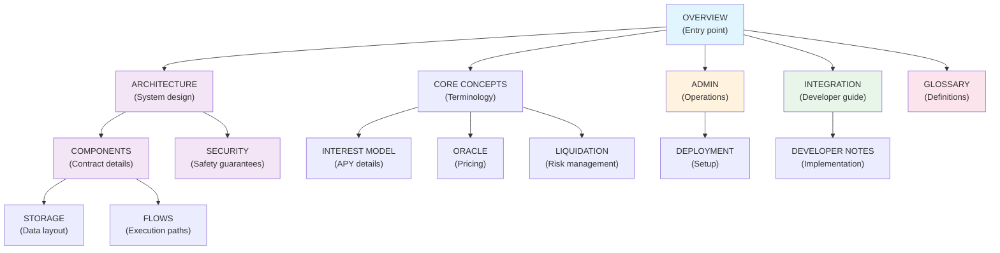

# K2 Lending Protocol - Documentation Index

A decentralized borrowing and lending protocol deployed on Stellar's Soroban smart-contract platform.

**Latest Version**: 1.0 (February 2026)
**Branch**: `security-hardening`

---

## Documentation Structure

This documentation is organized into 15 logical sections, each addressing a specific aspect of the protocol:

### 1. **Protocol Overview** (`01-OVERVIEW.md`)
High-level introduction, use cases, and protocol principles.

### 2. **Architecture Model** (`02-ARCHITECTURE.md`)
System design, contract interactions, and deployment model.

### 3. **Core Concepts** (`03-CORE-CONCEPTS.md`)
Fundamental definitions: reserves, collateral, debt, health factor, etc.

### 4. **System Components** (`04-COMPONENTS.md`)
Detailed documentation of each contract and module.

### 5. **Execution Flows** (`05-FLOWS.md`)
Step-by-step user operations: supply, borrow, repay, liquidate, etc.

### 6. **Liquidation System** (`06-LIQUIDATION.md`)
Comprehensive liquidation mechanics, two-step process, security features.

### 7. **Interest Model** (`07-INTEREST-MODEL.md`)
Interest rate curves, accrual mechanisms, APY calculations.

### 8. **DEX Integration** (`08-DEX-INTEGRATION.md`)
Swap adapters, collateral exchange, liquidation routing, slippage protection.

### 9. **Oracle Architecture** (`09-ORACLE.md`)
Price feeds, RedStone integration, staleness checks, circuit breaker.

### 10. **Security Model** (`10-SECURITY.md`)
Authorization patterns, invariants, emergency controls, risk management.

### 11. **Storage Architecture** (`11-STORAGE.md`)
Contract storage layout, bitmap design, data structures.

### 12. **Admin & Governance** (`12-ADMIN.md`)
Administrative operations, parameter management, upgrades.

### 13. **Deployment Guide** (`13-DEPLOYMENT.md`)
Build, deploy, initialize, and verify contracts.

### 14. **Integration Reference** (`14-INTEGRATION.md`)
Developer guides for integration, TypeScript bindings, API reference.

### 15. **Developer Notes** (`15-DEVELOPER.md`)
Test strategy, troubleshooting, edge cases, code examples.

### 16. **Glossary** (`16-GLOSSARY.md`)
Terminology, abbreviations, and precision values.

---

## Quick Start Paths

### I want to understand the protocol
1. Read [Protocol Overview](01-OVERVIEW.md)
2. Study [Core Concepts](03-CORE-CONCEPTS.md)
3. Explore [Architecture Model](02-ARCHITECTURE.md)

### I want to deploy K2
1. Review [System Components](04-COMPONENTS.md)
2. Follow [Deployment Guide](13-DEPLOYMENT.md)
3. Check [Admin & Governance](12-ADMIN.md)

### I want to integrate with K2
1. Read [Core Concepts](03-CORE-CONCEPTS.md)
2. Study [Execution Flows](05-FLOWS.md)
3. Review [Integration Reference](14-INTEGRATION.md)

### I want to understand liquidations
1. Start with [Core Concepts - Health Factor](03-CORE-CONCEPTS.md#health-factor)
2. Deep dive: [Liquidation System](06-LIQUIDATION.md)
3. Implementation: [Execution Flows - Liquidation](05-FLOWS.md#liquidation)

### I want to audit the protocol
1. [Security Model](10-SECURITY.md)
2. [Storage Architecture](11-STORAGE.md)
3. [Liquidation System](06-LIQUIDATION.md)
4. [Oracle Architecture](09-ORACLE.md)

---

## Key Documents by Role

### **Protocol Users**
- [Core Concepts](03-CORE-CONCEPTS.md)
- [Execution Flows](05-FLOWS.md)
- [Integration Reference](13-INTEGRATION.md)

### **Smart Contract Developers**
- [System Components](04-COMPONENTS.md)
- [Storage Architecture](10-STORAGE.md)
- [Developer Notes](14-DEVELOPER.md)
- [Integration Reference](13-INTEGRATION.md)

### **Frontend Developers**
- [Core Concepts](03-CORE-CONCEPTS.md)
- [Execution Flows](05-FLOWS.md)
- [Integration Reference](13-INTEGRATION.md) (TypeScript bindings)
- [Developer Notes](14-DEVELOPER.md)

### **Protocol Administrators**
- [Admin & Governance](11-ADMIN.md)
- [Deployment Guide](12-DEPLOYMENT.md)
- [Emergency Controls](09-SECURITY.md#emergency-controls)

### **Security Auditors**
- [Security Model](09-SECURITY.md)
- [Liquidation System](06-LIQUIDATION.md)
- [Oracle Architecture](08-ORACLE.md)
- [Storage Architecture](10-STORAGE.md)

### **Ecosystem Partners**
- [Protocol Overview](01-OVERVIEW.md)
- [Architecture Model](02-ARCHITECTURE.md)
- [Integration Reference](13-INTEGRATION.md)

---

## Navigation by Topic

### **Reserves & Assets**
- Core: [Core Concepts - Reserves](03-CORE-CONCEPTS.md#reserves)
- Management: [Admin & Governance - Reserve Management](11-ADMIN.md#reserve-management)
- Configuration: [Deployment Guide - Configure Reserves](12-DEPLOYMENT.md#configure-reserves)
- Implementation: [System Components - Reserve Logic](04-COMPONENTS.md#reserve-logic)

### **Interest Rates**
- Theory: [Interest Model](07-INTEREST-MODEL.md)
- Configuration: [Admin & Governance - Interest Rate Strategy](11-ADMIN.md#interest-rate-configuration)
- Implementation: [System Components - Interest Rate Strategy](04-COMPONENTS.md#interest-rate-strategy)

### **Liquidations**
- Overview: [Core Concepts - Health Factor & Liquidation](03-CORE-CONCEPTS.md#health-factor)
- Detailed Mechanics: [Liquidation System](06-LIQUIDATION.md)
- Execution: [Execution Flows - Liquidation](05-FLOWS.md#liquidation)
- Implementation: [System Components - Liquidation Logic](04-COMPONENTS.md#liquidation-logic)

### **Oracle & Pricing**
- Architecture: [Oracle Architecture](08-ORACLE.md)
- Integration: [Oracle Architecture - RedStone Integration](08-ORACLE.md#redstone-integration)
- Configuration: [Admin & Governance - Oracle Management](11-ADMIN.md#oracle-management)
- Implementation: [System Components - Price Oracle](04-COMPONENTS.md#price-oracle)

### **Security**
- Authorization: [Security Model - Authorization Patterns](09-SECURITY.md#authorization-patterns)
- Invariants: [Security Model - Protocol Invariants](09-SECURITY.md#protocol-invariants)
- Emergency Controls: [Security Model - Emergency Controls](09-SECURITY.md#emergency-controls)

### **Storage & Data**
- Overview: [Storage Architecture](10-STORAGE.md)
- User Tracking: [Storage Architecture - User Configuration](10-STORAGE.md#user-configuration)
- Reserve Data: [Storage Architecture - Reserve Data](10-STORAGE.md#reserve-data)

---

## Technical Reference

### **Precision & Scaling**
See [Glossary - Precision Values](15-GLOSSARY.md#precision-values)

| Value | Decimals | Use |
|-------|----------|-----|
| WAD | 1e18 | Health factor, normalized values |
| RAY | 1e27 | Interest indices, rate calculations |
| Basis Points | 10000 = 100% | LTV, thresholds, fees |
| Price Precision | 1e14 | Oracle prices (14 decimals) |

### **Key Formulas**
- **Health Factor**: [Core Concepts](03-CORE-CONCEPTS.md#health-factor)
- **Borrowing Power**: [Core Concepts](03-CORE-CONCEPTS.md#borrowing-power)
- **Interest Accrual**: [Interest Model](07-INTEREST-MODEL.md#interest-accrual)
- **Liquidation Amounts**: [Liquidation System](06-LIQUIDATION.md#calculating-liquidation-amounts)

### **Error Codes**
See [Developer Notes - Error Handling](14-DEVELOPER.md#error-codes)

---

## Cross-Document Reference Map

