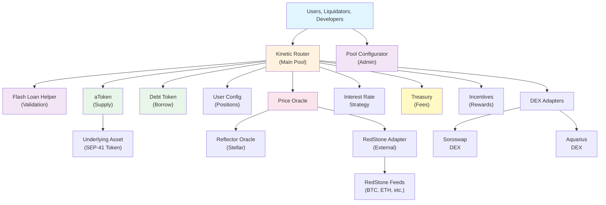
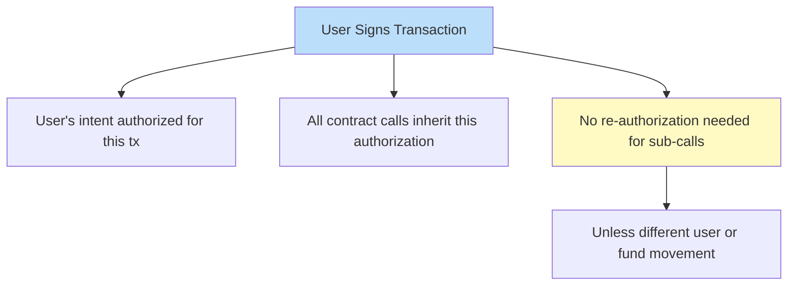
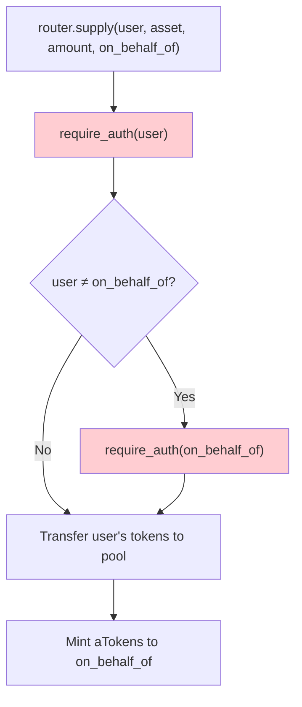
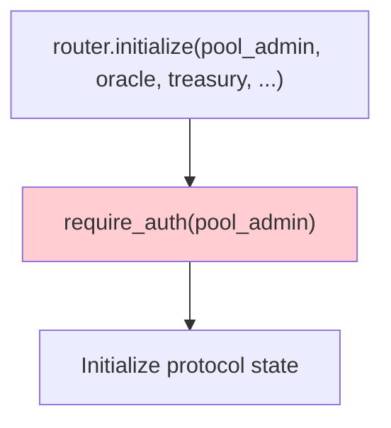
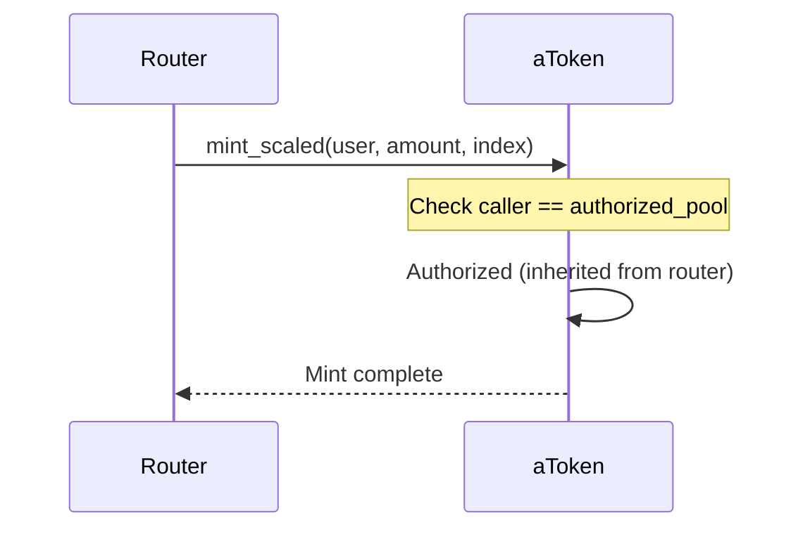
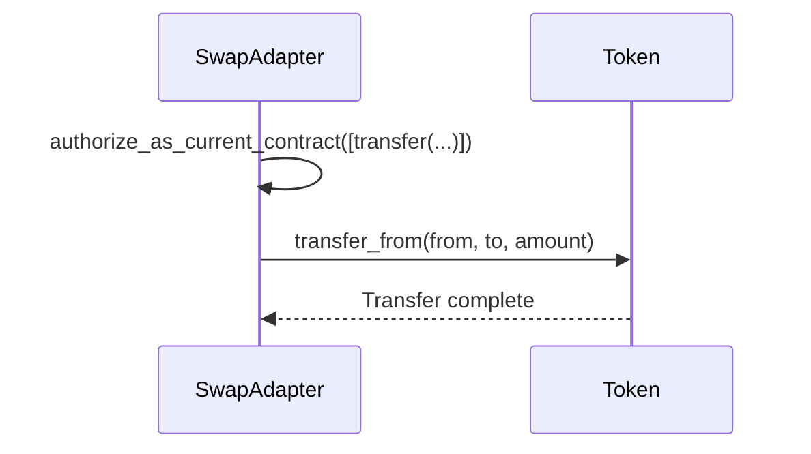

# 2. Architecture Model

## System Overview

K2's architecture follows a modular, contract-based design where each component has a specific responsibility.



---

## Contract Responsibilities

### **Kinetic Router** (Core)
**Entry point for all user operations.**

Responsibilities:
- User authentication and authorization
- Supply/withdraw asset operations
- Borrow/repay operations
- Liquidation execution (standard and two-step)
- Flash loan coordination
- Collateral swap execution
- Health factor validation
- Interest rate updates

Dependencies:
- Price Oracle (for valuations)
- Interest Rate Strategy (for rate calculations)
- Treasury (for fee collection)
- Swap Adapters (for liquidation and swaps)
- aToken & Debt Token contracts (for position management)

### **Pool Configurator** (Admin)
**Manages reserve lifecycle and protocol parameters.**

Responsibilities:
- Deploy new aToken and debtToken contracts
- Initialize new reserves
- Configure reserve parameters
- Manage supply/borrow caps
- Update protocol settings
- Reserve activation/deactivation

Dependencies:
- Kinetic Router (updates propagated here)
- aToken & Debt Token implementations

### **Price Oracle** (Core Dependency)
**Provides asset prices with manipulation protection.**

Responsibilities:
- Query asset prices
- Manage asset whitelist
- Validate staleness
- Circuit breaker for extreme movements
- Handle manual overrides
- Support multiple price sources

Data:
- Current prices (14 decimals)
- Timestamps (for staleness checks)
- Circuit breaker state
- Manual override values

### **Interest Rate Strategy** (Core Dependency)
**Calculates interest rates based on market conditions.**

Responsibilities:
- Calculate liquidity rate (supply APY)
- Calculate variable borrow rate
- Use utilization-based curve
- Support per-asset configuration
- Optimize for capital efficiency

Inputs:
- Total supply
- Total debt
- Reserve factor
- Optimal utilization

### **aToken** (Token Contract)
**Interest-bearing token representing supplied assets.**

Responsibilities:
- Track scaled balances
- Apply liquidity index for balance growth
- Support transfers (with whitelist validation)
- Mint on supply
- Burn on withdraw
- Transfer underlying to withdrawers

Features:
- Automatic interest accrual
- Whitelist enforcement
- Only pool can mint/burn

### **Debt Token** (Token Contract)
**Non-transferable token representing borrowed amounts.**

Responsibilities:
- Track scaled balances
- Apply borrow index for interest accrual
- Prevent transfers/approvals
- Mint on borrow
- Burn on repay
- Never held by users (read-only)

Features:
- Automatic interest accrual
- Non-transferable
- Only pool can mint/burn

### **Treasury** (Fund Management)
**Collects and manages protocol fees.**

Responsibilities:
- Receive protocol fees from liquidations
- Receive protocol fees from flash loans
- Withdraw funds (admin-only)
- Track balances per asset

### **Incentives** (Reward System)
**Distributes rewards to suppliers and borrowers.**

Responsibilities:
- Manage reward emissions
- Calculate user rewards
- Distribute reward tokens
- Support per-asset configuration

### **RedStone Adapter** (Oracle Integration)
**Bridges RedStone oracle network to K2.**

Responsibilities:
- Verify cryptographic signatures
- Validate timestamps
- Store external asset prices
- Implement Reflector-compatible interface
- Manage trusted signers

---

## Authorization Model

### **Authorization Tree** (Soroban)
Each transaction establishes authorization context once:



### **Authorization Patterns**

#### **1. User Operations**
Functions that move user funds require user authorization.



#### **2. Admin Operations**
Functions that change protocol state require admin authorization.



#### **3. Cross-Contract Authorization**
When contracts call each other's token operations.



#### **4. Self-Authorization** (Rare)
When a contract needs to authorize its own token transfers.


    -Adapter can now call token.transfer()
```

---

## Data Flow

### **Supply Operation**
```
User
  
  -Approve tokens �� aToken address
  
  -router.supply(user, asset, amount, on_behalf_of)
       
       -require_auth(user)
       -Validate whitelist
       -Update reserve state (accrue interest)
       -Validate supply cap
       
       -Transfer assets: user �� aToken
       
       -aToken.mint_scaled(on_behalf_of, amount, index)
          -Update user's scaled balance
       
       -Update user configuration bitmap
       -Update interest rates
            
            -Store new reserve state
```

### **Borrow Operation**
```
User (has collateral)
  
  -router.borrow(user, asset, amount, rate_mode, on_behalf_of)
       
       -require_auth(user)
       -Update reserve states (both assets)
       -Validate borrow cap
       -Get prices from oracle
       
       -Calculate health factor after borrow
          -Verify HF �� 1.0
       
       -Validate available liquidity
       
       -Debt Token.mint_scaled(on_behalf_of, amount, borrow_index)
       
       -aToken.transfer_underlying(on_behalf_of, amount)
          -Send borrowed assets to user
       
       -Update user configuration
       -Update interest rates
```

---

## Execution Model

### **Single-Transaction Operations**
Operations completing in one Soroban transaction:

- Supply (30-40M CPU)
- Withdraw (30-40M CPU)
- Borrow (40-50M CPU)
- Repay (30-40M CPU)
- Standard Liquidation (35-46M CPU, 2-5 reserves)
- Flash Loan (40-60M CPU)
- Swap Collateral (50-70M CPU)

### **Two-Transaction Operations**
Operations split across transactions for large computations:

**Two-Step Liquidation:**

Transaction 1: Preparation
- Validate liquidator
- Fetch prices
- Calculate health factor
- Calculate liquidation amounts
- Store authorization (10-min expiry, 600 ledgers)

Transaction 2: Execution
- Validate authorization
- Execute flash loan
- Perform collateral swap
- Settle debt
- Transfer profit

---

## State Persistence

### **Contract Storage**
Soroban stores contract state persistently:

```
Contract Instance Storage
-Instance Data (max 4 MB)
  -Simple key-value pairs
  -Admin addresses
  -Configuration parameters
  -Protocol state

-Temporary Data (TTL-managed)
   -User positions (balances)
   -Reserve data
   -Liquidation authorizations (10 min, 600 ledgers)
   -Price cache entries
```

### **TTL Management**
All contract data has a Time-To-Live (TTL):

- **TTL**: Up to 6 months per entry
- **Renewal**: Automatic on each read/write
- **Expiry**: Deleted if not renewed
- **Router Entry Points**: Extend TTL on major operations

---

## Integration Points

### **DEX Adapters**
Soroswap and Aquarius swap adapters enable:
- Collateral swaps (user can change collateral type)
- Flash liquidation swaps (liquidator swaps collateral �� debt asset)
- Two-step liquidation coordination

### **Price Feeds**
Two price feed sources:
- **Reflector**: Default for Stellar-native assets
- **RedStone**: External assets (BTC, ETH, stables)

### **Event Stream**
Off-chain indexers subscribe to events:
- User operations (supply, borrow, repay, withdraw)
- Liquidations
- Protocol state changes
- Administrative actions

---

## Deployment Topology

### **Testnet**
```
Deployment Network: testnet.stellar.org
-Kinetic Router (main contract)
-Pool Configurator (admin)
-Price Oracle (Reflector + RedStone)
-Interest Rate Strategy
-Treasury
-aToken implementation
-Debt Token implementation
-Soroswap Adapter
-Aquarius Adapter
-RedStone Adapter
-Liquidation Engine
-Flash Liquidation Helper
-Incentives
```

### **Mainnet**
```
Same contract set, deployed to mainnet.stellar.org
- Higher gas costs (higher CPU per operation)
- Conservative parameter defaults
- Multi-sig admin controls
- Emergency pause capability
```

---

## Upgrade Path

### **Business Logic Contracts** (Upgradeable)
- Kinetic Router
- Pool Configurator
- Interest Rate Strategy
- Price Oracle
- aToken & Debt Token
- All adapters

Upgrade Process:
1. Compile new WASM
2. Install on-chain (get hash)
3. Upgrade admin + pool admin call `upgrade(new_hash)` (dual-auth)
4. Code updated, storage preserved

### **Immutable Contracts** (Never Change)
- Shared library (math, types)
- Core cryptographic utilities

Reason: Upgrading breaks all dependents

---

## Next Steps

1. Understand each component: [System Components](04-COMPONENTS.md)
2. Learn execution flows: [Execution Flows](05-FLOWS.md)
3. Dive into storage: [Storage Architecture](10-STORAGE.md)

---

**Last Updated**: February 2026
