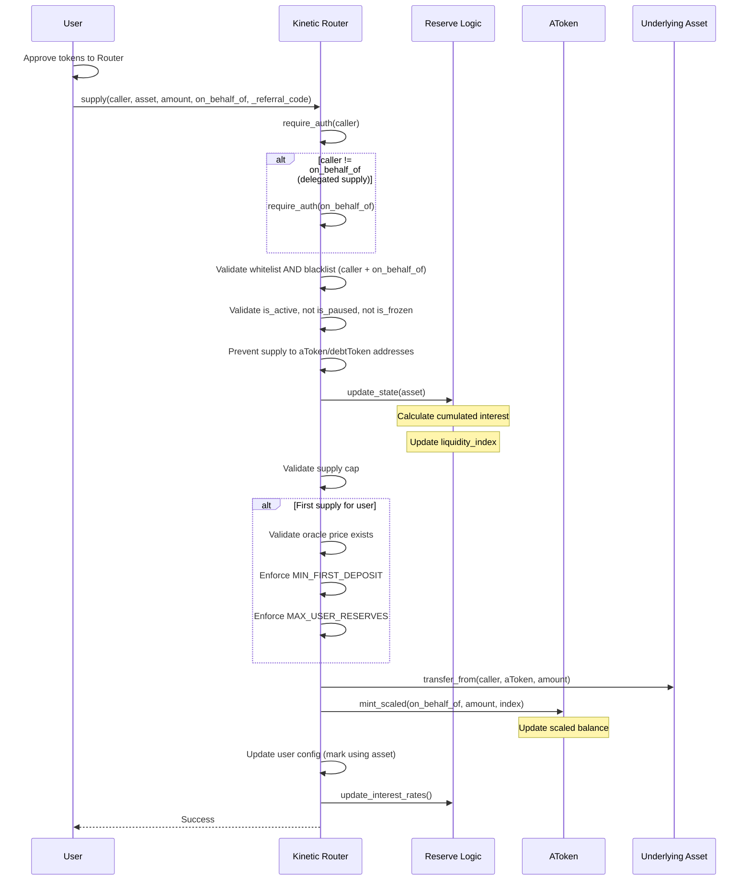
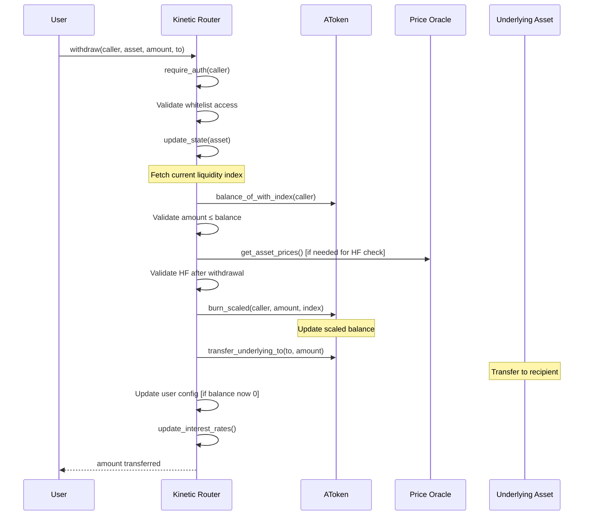
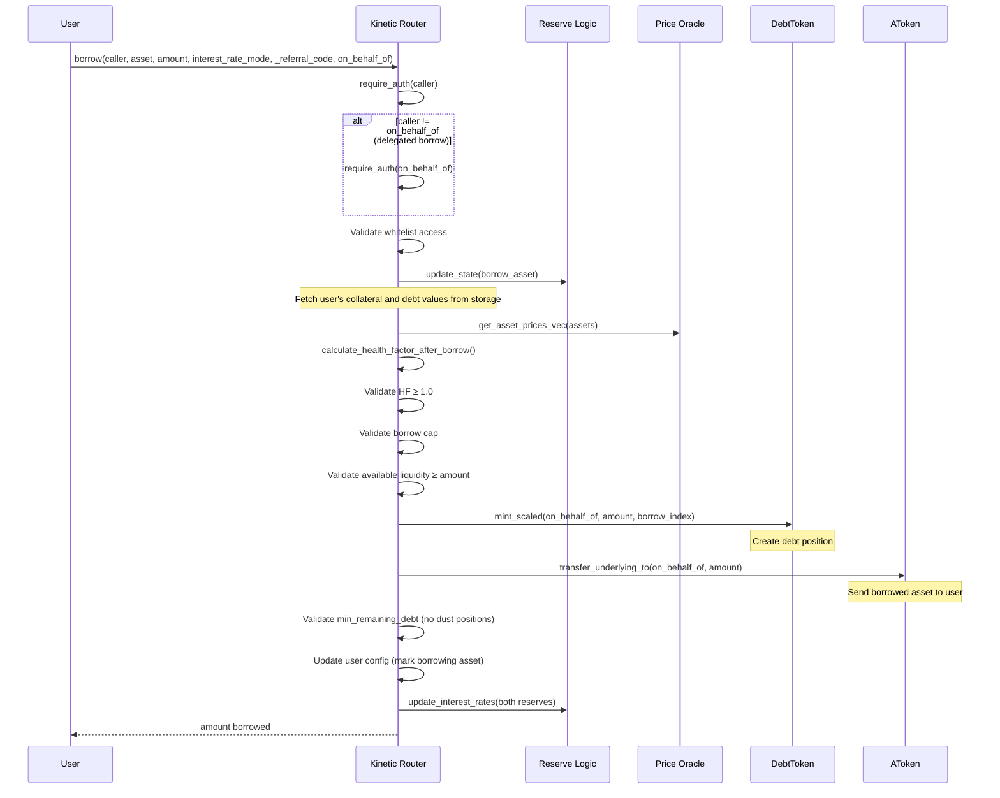
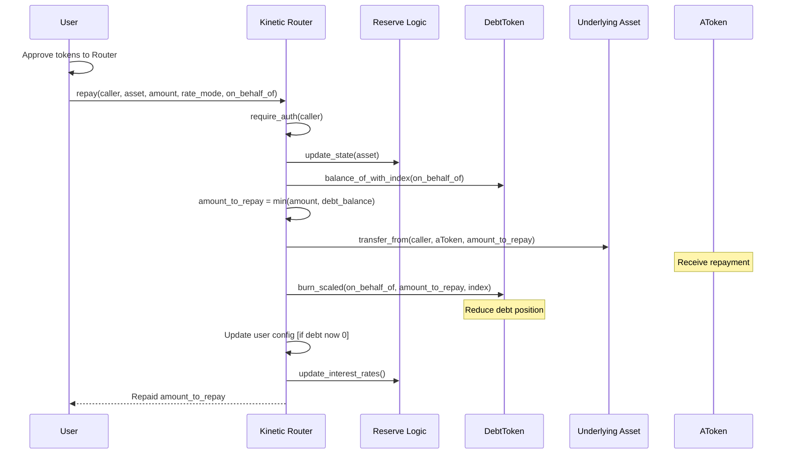
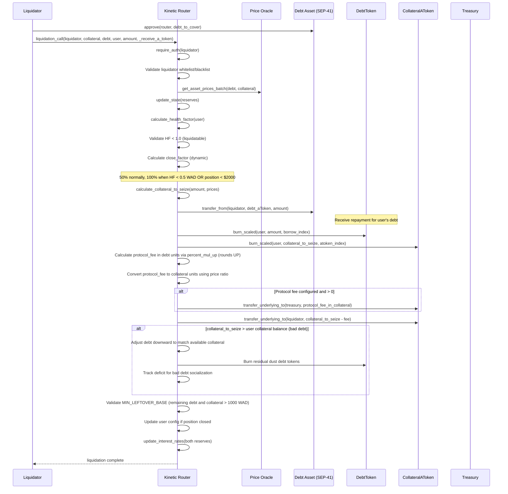
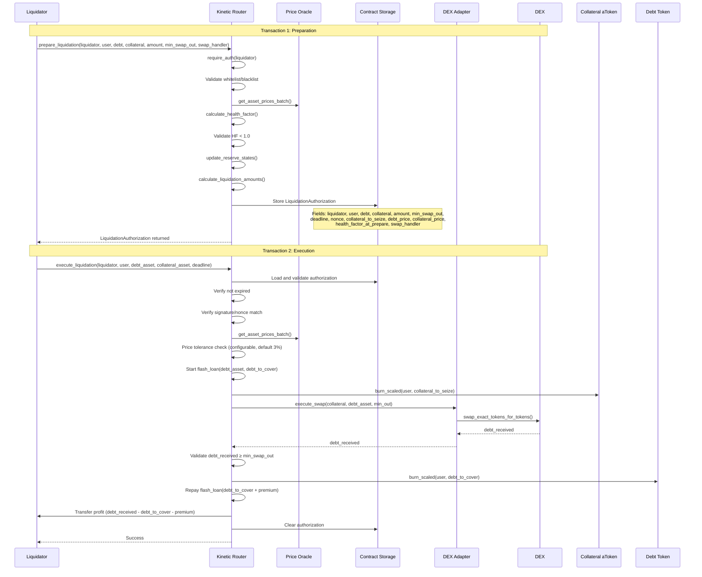
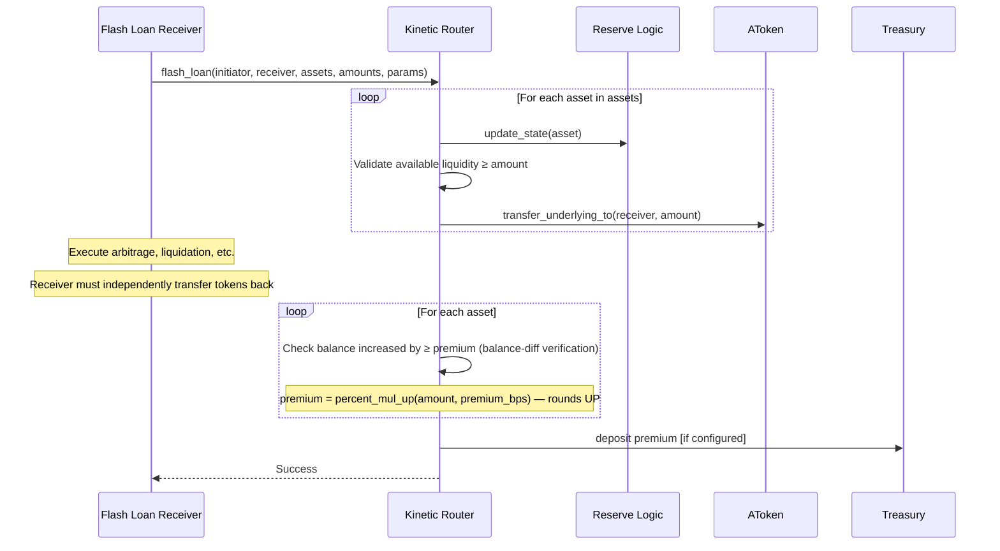
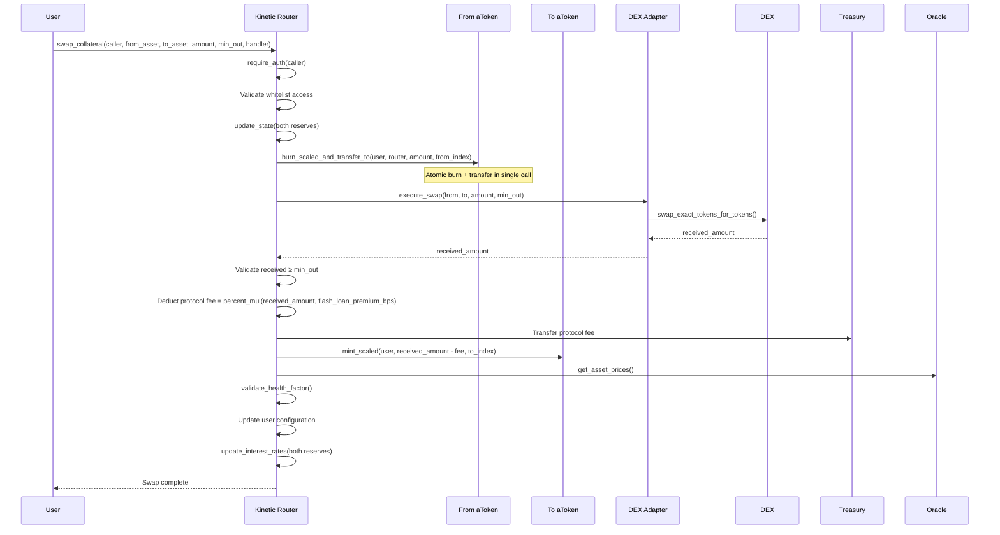

# 5. Execution Flows

Complete step-by-step execution paths for all major user operations.

---

## Supply (Deposit Assets)

**Purpose**: Deposit assets to earn interest. Receive aTokens in return.

### **Flow Diagram**



### **Execution Steps**

1. **Authorization**:
   - `require_auth(caller)` — verify user signed tx
   - If `caller != on_behalf_of` (delegated supply): `require_auth(on_behalf_of)`
2. **Validation**:
   - Check caller and on_behalf_of against whitelist AND blacklist
   - Verify asset is active (`is_active()`), not paused (`is_paused()`), not frozen (`is_frozen()`)
   - Prevent supply to aToken or debtToken addresses
3. **State Update**:
   - Call `update_reserve_state()` to accrue interest
   - Fetch current liquidity index
4. **Cap Check**:
   - Validate `current_supply + amount ≤ supply_cap`
5. **First Supply Checks** (if user has no existing position in this asset):
   - Validate oracle price exists for this asset
   - Enforce `MIN_FIRST_DEPOSIT` — first deposit must meet minimum threshold
   - Enforce `MAX_USER_RESERVES` — user cannot exceed maximum number of reserve positions
6. **Token Transfer**:
   - Transfer `amount` from caller to aToken contract
   - Validates caller has sufficient balance
7. **Position Creation**:
   - aToken.mint_scaled: `scaled_amount = amount / liquidity_index`
   - Update user's scaled balance
8. **User Config**:
   - Set bit in user configuration (mark using asset)
9. **Rate Update**:
   - Recalculate interest rates based on new utilization
   - Store updated reserve data

### **Invariant Checks**
- `supply_cap` not exceeded
- User has sufficient underlying balance
- Amount > 0
- Asset is active, not paused, not frozen
- First deposit meets `MIN_FIRST_DEPOSIT`
- User reserves count ≤ `MAX_USER_RESERVES`

### **Events Emitted**
- `SupplyEvent { reserve, user, on_behalf_of, amount, referral_code }`

---

## Withdraw (Redeem Supplied Assets)

**Purpose**: Redeem aTokens for underlying assets plus accrued interest.

### **Flow Diagram**



### **Execution Steps**

1. **Authorization**: `require_auth(caller)`
2. **Validation**:
   - Check caller against whitelist AND blacklist
   - If `caller != to`: validate recipient against whitelist and blacklist
   - Prevent withdrawal to aToken or debtToken addresses
3. **State Update**: Call `update_reserve_state()` to accrue interest
4. **Balance Check**:
   - Query aToken balance: `balance = scaled_balance × liquidity_index`
   - Handle `u128::MAX` (withdraw all)
5. **Health Factor**:
   - If user has debt: recalculate HF after withdrawal
   - Verify HF ≥ 1.0 (still safe)
6. **Burn aTokens**:
   - Calculate `scaled_amount = amount / liquidity_index`
   - Reduce user's scaled balance
7. **Transfer Underlying**:
   - aToken transfers underlying to recipient
8. **User Config**:
   - If balance = 0, clear collateral bit
9. **Rate Update**: Recalculate interest rates

### **Special Cases**
- **Full Withdrawal**: Use `amount = u128::MAX`
- **Partial Withdrawal**: `amount < balance`

### **Invariant Checks**
- Available liquidity ≥ amount
- User's HF ≥ 1.0 after (if borrowing)
- User's balance ≥ amount requested

### **Events Emitted**
- `WithdrawEvent { reserve, user, to, amount }`

---

## Borrow (Take Loan)

**Purpose**: Borrow assets against collateral. Pay interest on borrowed amount.

### **Flow Diagram**



### **Execution Steps**

1. **Authorization**:
   - `require_auth(caller)`
   - If `caller != on_behalf_of` (delegated borrow): `require_auth(on_behalf_of)`
2. **State Updates**:
   - Update borrow asset reserve state
   - Update all user's collateral reserve states (for accurate valuations)
3. **Price Fetch**:
   - Get prices for: borrowed asset + all user's collateral
4. **Health Factor Check**:
   - Calculate hypothetical HF if loan executes
   - Verify HF ≥ 1.0 (must stay safe)
5. **Validations**:
   - Borrow cap not exceeded
   - Available liquidity sufficient
   - Borrowing enabled on asset
6. **Debt Token Mint**:
   - Calculate `scaled_debt = amount / borrow_index`
   - Create debt position
7. **Asset Transfer**:
   - aToken transfers underlying to borrower
8. **Dust Check**:
   - Enforce `min_remaining_debt` — resulting debt must exceed minimum threshold to prevent dust positions
9. **User Config**:
   - Set borrowing bit for this reserve
10. **Rate Updates**:
    - Recalculate rates for both reserves

### **Invariant Checks**
- `HF ≥ 1.0` after borrow
- `borrow_cap` not exceeded
- Available liquidity sufficient
- Amount > 0
- Resulting debt ≥ `min_remaining_debt`

### **Events Emitted**
- `BorrowEvent { reserve, user, on_behalf_of, amount, borrow_rate, borrow_rate_mode, referral_code }`

---

## Repay (Return Borrowed Assets)

**Purpose**: Repay borrowed debt. Interest is automatically included.

### **Flow Diagram**



### **Execution Steps**

1. **Authorization**: `require_auth(caller)`
2. **State Update**: Call `update_reserve_state()` to accrue interest
3. **Debt Balance**:
   - Query debt token: `debt = scaled_debt × borrow_index`
   - Calculate repay amount: `min(requested, actual_debt)`
4. **Token Transfer**:
   - Transfer repay amount from repayer to aToken
5. **Burn Debt**:
   - Calculate `scaled_amount = amount_to_repay / borrow_index`
   - Reduce user's scaled debt
6. **User Config**:
   - If debt = 0, clear borrowing bit
7. **Rate Update**: Recalculate interest rates

### **Special Cases**
- **Partial Repay**: `amount < debt` — partial repay must not leave remaining debt below `min_remaining_debt`, otherwise a `RepayWouldLeaveDust` error is returned
- **Full Repay**: `amount ≥ debt` (pays exact debt amount; excess stays in caller's wallet — no funds are returned)
- **Over-Repay**: Amount is capped at the actual debt balance. The caller only transfers the capped amount; excess is never taken from the caller

### **Blacklist Nuance**
- Caller is checked against both whitelist AND blacklist
- `on_behalf_of` is only checked against whitelist (intentional: blacklisted borrowers must still be repayable by others)

### **Invariant Checks**
- User's debt ≥ repay amount (after capping)
- Amount > 0
- Partial repay: remaining debt ≥ `min_remaining_debt` (dust prevention)

### **Events Emitted**
- `RepayEvent { reserve, user, repayer, amount, use_a_tokens: false }`

---

## Standard Liquidation

**Purpose**: Liquidate undercollateralized position in single transaction.

### **Flow Diagram**



### **Execution Steps**

1. **Authorization**: `require_auth(liquidator)`
2. **Access Control**: Validate liquidator whitelist/blacklist
3. **Fetch Prices**: Get prices for debt and collateral assets
4. **Reserve Updates**: Accrue interest on both reserves
5. **Health Check**:
   - Calculate user's health factor
   - Verify HF < 1.0 (position liquidatable)
6. **Close Factor** (dynamic):
   - 50% of total debt normally
   - 100% (full liquidation) when HF < 0.5 WAD OR total position value < $2000
7. **Collateral Calculation**:
   - Convert debt amount to collateral units
   - Apply liquidation bonus: `collateral_with_bonus = collateral × (10000 + bonus) / 10000`
8. **Debt Repayment**:
   - Transfer debt asset from liquidator to debt aToken
9. **Burn Tokens**:
   - Burn user's debt tokens: reduce debt
   - Burn user's collateral aTokens: remove collateral
10. **Fee Collection**:
    - Calculate `protocol_fee` in debt units via `percent_mul_up` (rounds UP in favor of protocol)
    - Convert fee to collateral units using the debt/collateral price ratio
    - Transfer fee in collateral to treasury (if configured)
11. **Liquidator Payout**:
    - Transfer remaining collateral to liquidator
12. **Bad Debt Handling** (if `collateral_to_seize > user balance`):
    - Debt is adjusted downward to match available collateral
    - Residual dust debt tokens are burned
    - Deficit is tracked for bad debt socialization
13. **Leftover Check**:
    - `MIN_LEFTOVER_BASE` — remaining debt and collateral must each exceed 1000 WAD after liquidation (prevents dust positions)
14. **Cleanup**:
    - Update user config if fully closed
    - Recalculate interest rates

### **Invariant Checks**
- User's HF < 1.0 before liquidation
- Close factor respected (50% normally; 100% when HF < 0.5 WAD or position < $2000)
- Collateral sufficient to cover debt + bonus + fee
- Remaining debt and collateral each exceed `MIN_LEFTOVER_BASE` (1000 WAD)

### **Events Emitted**
```rust
LiquidationCallEvent {
    collateral_asset,
    debt_asset,
    user,
    debt_to_cover: amount,
    liquidated_collateral_amount: collateral_to_seize,
    liquidator,
    receive_a_token: false,
    protocol_fee,
    liquidator_collateral: collateral_to_seize - protocol_fee
}
```

---

## Two-Step Liquidation

**Purpose**: Liquidate large positions by splitting into two transactions.

### **Flow Diagram**



### **Phase 1: Preparation**

1. **Validation**:
   - Whitelist/blacklist check
   - Parameter validation

2. **Health Factor Calculation**:
   - Loop through all user reserves
   - Fetch prices for each
   - Calculate weighted threshold

3. **Reserve Updates**:
   - Accrue interest on both reserves
   - Get current indices

4. **Liquidation Amounts**:
   - Calculate debt to cover
   - Calculate collateral to seize
   - Calculate minimum swap output (slippage protection)

5. **Storage**:
   - Store authorization with 600-second (10-minute) TTL
   - Include nonce for replay protection
   - Store deadline for execution

### **Phase 2: Execution**

1. **Authorization Validation**:
   - Load stored authorization
   - Verify expiry (600 seconds / 10 minutes)
   - Verify nonce matches
   - Verify parameters match

2. **Price Sanity Check**:
   - Fetch prices again
   - Verify within tolerance of prepare phase (prevents oracle manipulation)

3. **Flash Loan**:
   - Borrow debt asset (amount to cover)
   - Initiate swap immediately

4. **Collateral Swap**:
   - Burn collateral aTokens
   - Swap collateral → debt asset via DEX
   - Validate minimum swap output

5. **Settlement**:
   - Burn user's debt tokens
   - Repay flash loan + premium
   - Transfer profit to liquidator

### **Invariant Checks**
- Authorization valid and not expired
- Price tolerance within configured bounds (default 3%)
- Swap output meets minimum
- Profit calculation correct

### **Events Emitted**
- Phase 1: Raw topic/data event — `symbol_short!("prep_ok")` with authorization data (not a typed struct)
- Phase 2: Raw topic/data event — `symbol_short!("exec_ok")` with execution data (not a typed struct)
- `FlashLoanEvent` (during Phase 2)

---

## Flash Loan

**Purpose**: Borrow without collateral, must repay in same transaction.

### **Flow Diagram**



### **Execution Steps**

1. **Reserve Update**: Accrue interest on each asset
2. **Liquidity Check**: Verify available supply ≥ amount for each asset
3. **Loan Disbursal**: Transfer each asset to receiver
4. **Receiver Logic**: Receiver executes arbitrage, liquidation, etc.
5. **Repayment Verification** (balance-diff, not approve+transfer_from):
   - Calculate premium: `premium = percent_mul_up(amount, premium_bps)` — rounds UP
   - Receiver must independently transfer tokens back to the pool
   - Router verifies balance increased by at least the premium amount
6. **Fee Collection**: Premium goes to treasury
7. **Completion**: Transaction succeeds

### **Invariant Checks**
- Available liquidity sufficient
- Repayment complete (amount + premium)
- Amount > 0

### **Events Emitted**
Raw topic/data publish per asset (not a typed struct):
- **Topic**: `(Symbol("flash_loan"), initiator, asset)`
- **Data**: `(receiver, amount, premium)`

---

## Swap Collateral

**Purpose**: Exchange one collateral for another without withdrawing.

### **Flow Diagram**



### **Execution Steps**

1. **Authorization**: `require_auth(caller)`
2. **State Updates**: Accrue interest on both reserves
3. **Burn From Collateral**:
   - Atomic `burn_scaled_and_transfer_to`: burns user's from-asset aTokens and transfers underlying to router in a single call
4. **Execute Swap**:
   - Call swap adapter
   - Validate minimum output
5. **Protocol Fee**:
   - Deduct `percent_mul(received_amount, flash_loan_premium_bps)` as protocol fee
   - Transfer fee to treasury
6. **Mint To Collateral**:
   - Mint to-aToken to user (amount received minus fee)
7. **Health Factor Check**:
   - Verify HF ≥ 1.0 after swap
8. **Config Update**:
   - Update user configuration for both assets
9. **Rate Updates**: Recalculate for both reserves

### **Invariant Checks**
- User's HF ≥ 1.0 after swap
- Swap output ≥ minimum
- Amount > 0

### **Events Emitted**
- No `WithdrawEvent` or `SupplyEvent` is emitted by swap collateral — the swap.rs module emits zero events
- DEX-level events may be emitted by the underlying swap adapter/DEX

---

## Next Steps

1. Understand liquidation in detail: [Liquidation System](06-LIQUIDATION.md)
2. Learn interest mechanics: [Interest Model](07-INTEREST-MODEL.md)
3. Study pricing: [Oracle Architecture](08-ORACLE.md)

---

**Last Updated**: March 2026
**Status**: Stable
