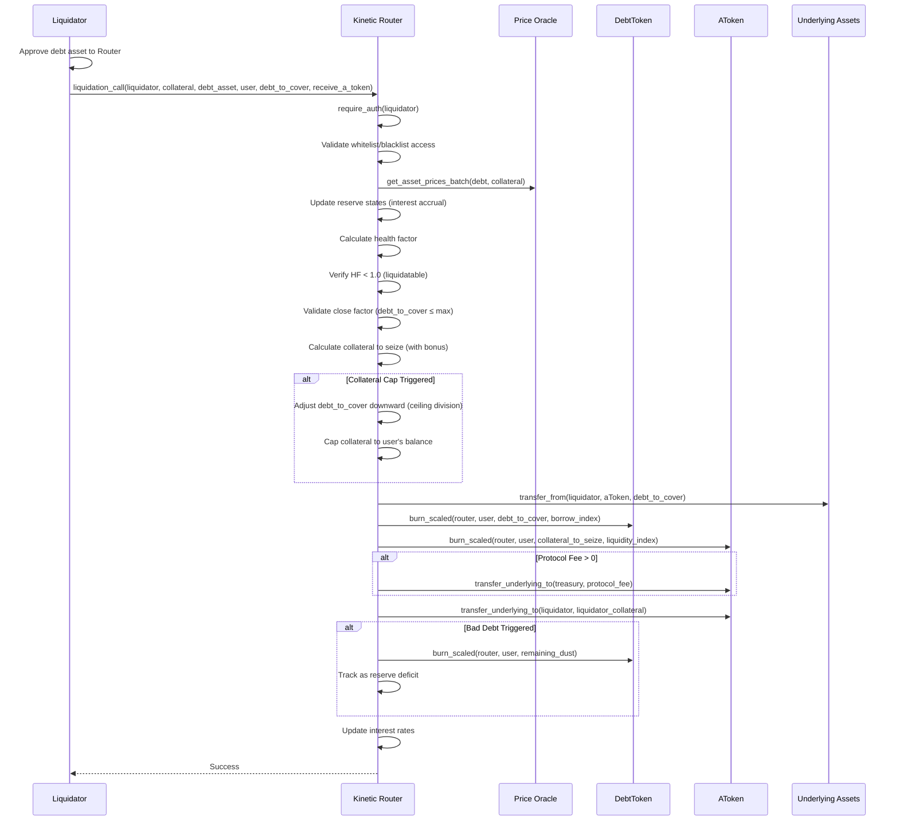
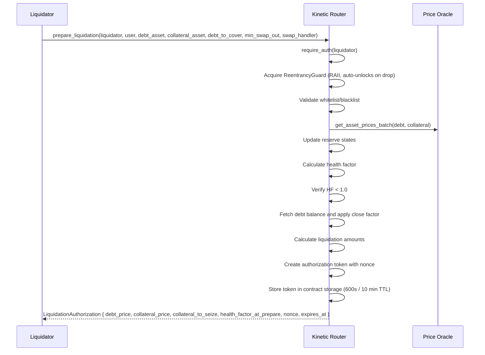
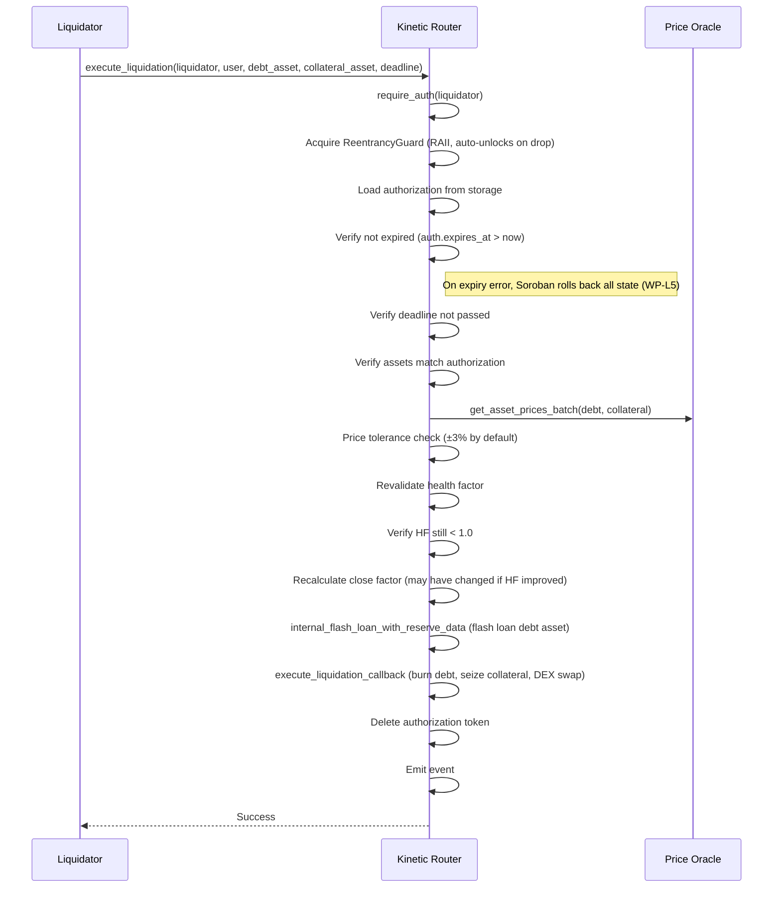
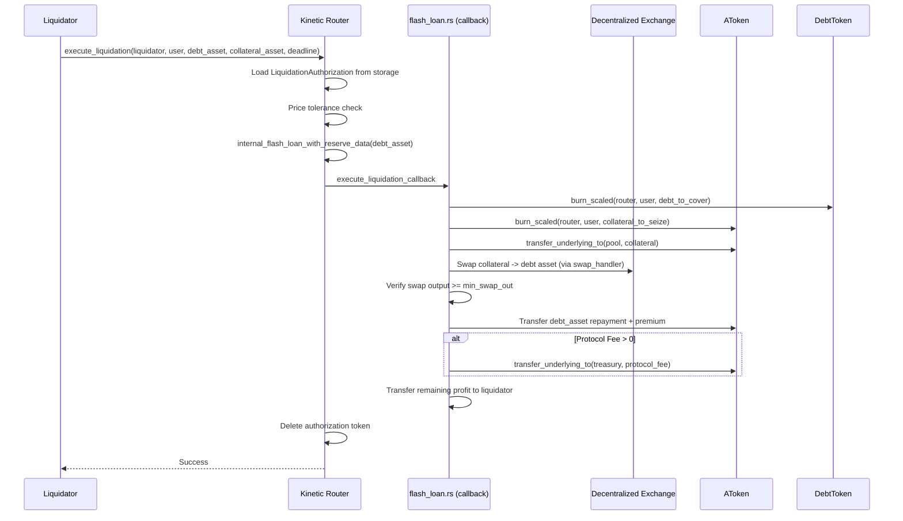

# 6. Liquidation System

Comprehensive documentation of the K2 protocol's liquidation mechanics, including standard liquidation, two-step liquidation, flash liquidation, and security features.

---

## Overview

The liquidation system is the primary risk-management mechanism of the K2 protocol. When a user's health factor falls below 1.0 (meaning collateral value can no longer cover debt + threshold buffer), liquidators can repay a portion of the user's debt in exchange for receiving the user's collateral at a discount (liquidation bonus).

### **Key Concepts**

- **Liquidatable Position**: Health factor < 1.0 (collateral × threshold / debt < 1.0)
- **Close Factor**: Maximum percentage of debt that can be liquidated in one call (50% or 100%)
- **Liquidation Bonus**: Premium paid to liquidators (e.g. 5%)
- **Protocol Fee**: Optional fee deducted from liquidation bonus
- **Liquidator**: Any whitelisted address that performs the liquidation

### **Security Objectives**

1. Protect collateral value from uncollateralized borrowing
2. Prevent over-liquidation and sandwich attacks
3. Allow liquidations even when collateral cap is hit
4. Handle dust debt through bad debt socialization

---

## Health Factor Monitoring

### **Liquidation Threshold**

A position becomes liquidatable when:

```
Health Factor = (Collateral Value × Liquidation Threshold) / Debt Value < 1.0
```

Or equivalently:

```
Collateral Value × Liquidation Threshold < Debt Value
```

### **Health Factor Calculation**

```rust
pub fn calculate_health_factor_u256(
    collateral_in_base_currency: u128,        // WAD precision (1e18)
    current_liquidation_threshold: u128,       // Basis points (0-10000)
    debt_in_base_currency: u128,               // WAD precision
) -> u128 {
    // Formula: HF = collateral * threshold * WAD / 10000 / debt
    // Uses U256 for intermediate calculations to prevent overflow
    if debt_in_base_currency == 0 {
        return u128::MAX  // No debt = fully healthy
    }
    collateral * threshold * WAD / 10000 / debt
}
```

### **Example Scenario**

```
User Position:
- Collateral: $1000 USDC (LTV = 75%, Threshold = 80%)
- Debt: $750 USDT

Health Factor = 1000 * 0.80 / 750 = 1.067

User remains safe. To become liquidatable:
- Debt increases to $800+ (HF < 1.0)
- Collateral drops to $750 or less (HF < 1.0)
- Threshold decreases (governance action)
```

---

## Standard Liquidation

**Single-transaction process** where validation and execution occur atomically.

### **Flow Diagram**



### **Execution Steps**

1. **Authorization**:
   - `require_auth(liquidator)` - Verify liquidator signed transaction
   - Validate liquidator in whitelist (if enabled)
   - Validate liquidator not in blacklist

2. **Price Fetch**:
   - Get current prices for both debt and collateral assets
   - Validate prices are fresh and non-zero

3. **State Update**:
   - Update debt reserve state (accrue interest on debt)
   - Update collateral reserve state (accrue interest on collateral)

4. **Health Factor Check**:
   - Calculate user's current health factor
   - Verify HF < 1.0 (position is liquidatable)
   - If HF ≥ 1.0, revert with `InvalidLiquidation`

5. **Debt Balance Query**:
   - Query user's actual debt balance for the specific asset (scaled × borrow index)
   - If debt = 0, revert with `NoDebtOfRequestedType` (individual asset check)
   - Note: If total debt is zero, the HF check in step 4 catches it first (HF = u128::MAX) and returns `InvalidLiquidation`

6. **Close Factor Validation**:
   ```
   // Close factor becomes 100% when ANY of:
   //   - HF < partial_liquidation_threshold (0.5 WAD = 500_000_000_000_000_000)
   //   - individual_debt_base < MIN_CLOSE_FACTOR_THRESHOLD ($2,000 WAD)
   //   - individual_collateral_base < MIN_CLOSE_FACTOR_THRESHOLD ($2,000 WAD)
   if HF < partial_liq_threshold
       OR individual_debt_base < MIN_CLOSE_FACTOR_THRESHOLD
       OR individual_collateral_base < MIN_CLOSE_FACTOR_THRESHOLD:
       max_debt = user_debt  // 100% can be liquidated
   else:
       max_debt = user_debt × 0.5  // Only 50% can be liquidated

   if debt_to_cover > max_debt:
       revert LiquidationAmountTooHigh
   ```

7. **Collateral Amount Calculation**:
   - Convert debt_to_cover to base currency using price and decimals
   - Apply liquidation bonus (e.g., +5%)
   - Convert to collateral units

8. **Collateral Cap Handling**:
   ```
   if collateral_to_seize > user_collateral_balance:
       collateral_cap_triggered = true
       // Adjust debt downward to match available collateral (ceiling division)
       adjusted_debt = ceil(debt_to_cover × user_balance / collateral_to_seize)
                     = (debt_to_cover × user_balance + collateral_to_seize - 1) / collateral_to_seize
       collateral_to_seize = user_collateral_balance
   ```

9. **Debt Transfer**:
   - Transfer debt_to_cover from liquidator to aToken
   - Liquidator must have sufficient balance

10. **Debt Burn**:
    - Call `burn_scaled()` on debt token
    - Update user's debt position
    - Trigger incentive calculations if configured

11. **Collateral Seizure**:
    - Call `burn_scaled()` on aToken
    - Reduce user's collateral balance

12. **Protocol Fee Calculation**:
    ```
    protocol_fee_bps = flash_loan_premium (repurposed)

    // Fee computed in debt terms first via percent_mul_up (rounds UP)
    protocol_fee_debt = percent_mul_up(debt_to_cover, protocol_fee_bps)

    // Then converted to collateral terms using prices
    protocol_fee_collateral = protocol_fee_debt × debt_price × collateral_decimals
                             / (collateral_price × debt_decimals)

    liquidator_collateral = collateral_to_seize - protocol_fee_collateral
    ```

13. **Fee Transfer**:
    - If protocol_fee > 0 and treasury configured
    - Transfer fee from aToken to treasury

14. **Collateral Transfer**:
    - Transfer remaining collateral (with bonus) to liquidator
    - Liquidator receives: collateral_to_seize - protocol_fee

15. **Dust Debt Handling & MIN_LEFTOVER_BASE Check** (WP-L7):
    ```
    remaining_debt = user_debt - debt_to_cover

    if remaining_debt > 0:
        if collateral_cap_triggered:
            // H-05: All collateral seized — remaining debt is unrecoverable bad debt.
            // Socialize unconditionally (threshold is irrelevant here).
            burn_scaled(router, user, remaining_debt)
            add_reserve_deficit(debt_asset, remaining_debt)
        else if min_remaining_whole > 0:
            // Normal dust revert (skip when min_remaining_whole == 0)
            if remaining_debt < min_remaining_debt:
                revert LeavesTooLittleDebt

        // WP-L7: Both remaining debt and collateral must exceed MIN_LEFTOVER_BASE (1000 WAD)
        if remaining_debt_value < MIN_LEFTOVER_BASE
            OR remaining_collateral_value < MIN_LEFTOVER_BASE:
            revert LeavesTooLittleDebt
    ```

16. **Interest Rate Update**:
    - Recalculate reserve interest rates based on new utilization
    - Store updated reserve data

17. **Event Emission**:
    ```
    LiquidationCallEvent {
        collateral_asset,
        debt_asset,
        user,
        debt_to_cover,
        liquidated_collateral_amount,
        liquidator,
        protocol_fee,
        liquidator_collateral,
    }
    ```

---

## Two-Step Liquidation

**Split validation and execution** with a time-locked authorization token. Enables off-chain computation and batch processing.

### **Use Cases**

1. Liquidate without paying price oracle costs upfront
2. Batch multiple liquidations with single price fetch
3. Implement MEV-resistant liquidation strategies
4. Allow liquidations when prices change between validation and execution

### **Phase 1: Validation (`prepare_liquidation`)**


**Output**: `LiquidationAuthorization` containing:
```rust
pub struct LiquidationAuthorization {
    pub liquidator: Address,
    pub user: Address,
    pub debt_asset: Address,
    pub collateral_asset: Address,
    pub debt_to_cover: u128,
    pub collateral_to_seize: u128,     // Pre-computed collateral amount
    pub min_swap_out: u128,
    pub debt_price: u128,              // Snapshot at validation time
    pub collateral_price: u128,        // Snapshot at validation time
    pub health_factor_at_prepare: u128, // HF snapshot for audit trail
    pub expires_at: u64,               // Current timestamp + 600 seconds (10 minutes)
    pub nonce: u64,                    // Replay protection
    pub swap_handler: Option<Address>,
}
```

### **Phase 2: Execution (`execute_liquidation`)**



### **Comparison: Standard vs Two-Step**

| Aspect | Standard | Two-Step |
|--------|----------|----------|
| **Transactions** | 1 atomic | 2 sequential |
| **Authorization** | In-tx validation | Deferred to execution |
| **Price Snapshot** | Fresh at execution | Captured at validation |
| **Time Window** | None | 10 minutes (600s) |
| **Price Tolerance** | Not enforced | Configurable (default 3%) |
| **Use Case** | Direct liquidation | MEV resistance, batching |

### **Price Tolerance Check**

When executing a two-step liquidation, current prices must be within tolerance of captured prices:

```
tolerance_bps = 300 (3% by default, configurable)
lower_factor = 10000 - tolerance_bps = 9700
upper_factor = 10000 + tolerance_bps = 10300

debt_price_min = auth.debt_price × 9700 / 10000
debt_price_max = auth.debt_price × 10300 / 10000

if current_debt_price < debt_price_min or > debt_price_max:
    revert InvalidLiquidation  // Price moved too much
```

This prevents liquidators from executing when prices have moved significantly, which could make the liquidation unprofitable or create MEV opportunities.

---

## Liquidation Amounts Calculation

### **Step 1: Convert Debt to Base Currency**

Input: `debt_to_cover` (in asset units, e.g., 100 USDT)

```
debt_decimals = 6  (USDT has 6 decimals)
debt_price = 100000000 (from oracle, 8 decimals)
oracle_to_wad = 10^(18 - 8) = 10^10

debt_to_cover_base = debt_to_cover * debt_price * oracle_to_wad / 10^debt_decimals
                   = 100 * 100000000 * 10^10 / 10^6
                   = 100 * 10^8 * 10^10 / 10^6
                   = 10^22 / 10^6
                   = 10^16 (in WAD = 1e18)
                   = 0.01 WAD
```

### **Step 2: Convert to Collateral Units (Without Bonus)**

Input: `debt_to_cover_base` (in WAD), collateral prices and decimals

```
collateral_decimals = 18  (e.g., stETH)
collateral_price = 3000 * 10^8  (in oracle precision)
oracle_to_wad = 10^10

collateral_amount_without_bonus = debt_to_cover_base * collateral_decimals_pow
                                / (collateral_price * oracle_to_wad)
                                = 10^16 * 10^18 / (3000 * 10^8 * 10^10)
                                = 10^34 / (3 * 10^21)
                                = 10^13 / 3
                                ≈ 3.33 * 10^12 (in asset units, scaled by decimals)
```

For user-friendly output, divide by decimals:
```
user_amount = 3.33 * 10^12 / 10^18 = 0.00333 collateral units
```

### **Step 3: Apply Liquidation Bonus**

```
liquidation_bonus_bps = 500  (5%)

bonus_amount = debt_to_cover_base * liquidation_bonus_bps / 10000
             = 10^16 * 500 / 10000
             = 10^16 * 0.05
             = 5 * 10^14

collateral_amount_base_with_bonus = debt_to_cover_base + bonus_amount
                                  = 10^16 + 5 * 10^14
                                  = 1.05 * 10^16
```

### **Step 4: Convert to Collateral Units (With Bonus)**

```
collateral_amount_to_seize = collateral_amount_base_with_bonus * collateral_decimals_pow
                           / (collateral_price * oracle_to_wad)
                           = 1.05 * 10^16 * 10^18 / (3 * 10^21)
                           = 1.05 * 10^34 / (3 * 10^21)
                           = 1.05 * 10^13 / 3
                           ≈ 3.5 * 10^12
```

User amount: `3.5 * 10^12 / 10^18 ≈ 0.0035 collateral units`

### **Implementation**

```rust
pub fn calculate_liquidation_amounts_with_reserves(
    env: &Env,
    collateral_reserve: &ReserveData,
    debt_reserve: &ReserveData,
    debt_to_cover: u128,
    collateral_price: u128,
    debt_price: u128,
    oracle_to_wad: u128,
) -> Result<(u128, u128), KineticRouterError> {
    let collateral_decimals = collateral_reserve.configuration.get_decimals() as u32;
    let debt_decimals = debt_reserve.configuration.get_decimals() as u32;

    let debt_decimals_pow = 10u128.checked_pow(debt_decimals)?;

    // Step 1: debt_to_cover  -> base currency (WAD)
    let debt_to_cover_base = {
        let dtc = U256::from_u128(env, debt_to_cover);
        let dp = U256::from_u128(env, debt_price);
        let otw = U256::from_u128(env, oracle_to_wad);
        let ddp = U256::from_u128(env, debt_decimals_pow);
        dtc.mul(&dp).mul(&otw).div(&ddp).to_u128()?
    };

    let decimals_pow = 10u128.checked_pow(collateral_decimals)?;

    // Step 2: base currency  -> collateral units (without bonus)
    let collateral_amount_without_bonus = {
        let dtcb = U256::from_u128(env, debt_to_cover_base);
        let dp = U256::from_u128(env, decimals_pow);
        let cp = U256::from_u128(env, collateral_price);
        let otw = U256::from_u128(env, oracle_to_wad);
        let denominator = cp.mul(&otw);
        dtcb.mul(&dp).div(&denominator).to_u128()?
    };

    // Step 3: Apply bonus
    let liquidation_bonus_bps = collateral_reserve.configuration.get_liquidation_bonus() as u128;
    let bonus_amount = {
        let dtcb = U256::from_u128(env, debt_to_cover_base);
        let lbb = U256::from_u128(env, liquidation_bonus_bps);
        let bpm = U256::from_u128(env, BASIS_POINTS_MULTIPLIER);
        dtcb.mul(&lbb).div(&bpm).to_u128()?
    };

    let collateral_amount_base_with_bonus = debt_to_cover_base
        .checked_add(bonus_amount)?;

    // Step 4: Convert to collateral units (with bonus)
    let collateral_amount_to_seize = {
        let cabwb = U256::from_u128(env, collateral_amount_base_with_bonus);
        let dp = U256::from_u128(env, decimals_pow);
        let cp = U256::from_u128(env, collateral_price);
        let otw = U256::from_u128(env, oracle_to_wad);
        let denominator = cp.mul(&otw);
        cabwb.mul(&dp).div(&denominator).to_u128()?
    };

    Ok((collateral_amount_without_bonus, collateral_amount_to_seize))
}
```

### **Precision Considerations**

- **U256 Arithmetic**: All intermediate calculations use U256 to prevent overflow
- **Multiply-First, Divide-Last**: Order operations as `(a × b × c) / d` not `(a / d) × b × c`
- **No Truncation**: Division happens only once at the end
- **Oracle-to-WAD Factor**: Essential for converting from oracle precision (e.g., 8) to WAD (18)

---

## Close Factor

### **Definition**

The **close factor** is the maximum percentage of a user's debt that can be liquidated in a single transaction.

```
max_liquidatable_debt = total_user_debt × close_factor / 10000
```

### **Close Factor Tiers**

| Condition | Close Factor | Max Liquidation |
|---|---|---|
| HF ≥ 0.5 WAD AND position > $2,000 | 50% (5000 bps) | Half of debt |
| HF < 0.5 WAD (500_000_000_000_000_000) | 100% (10000 bps) | All of debt |
| individual_debt_base < MIN_CLOSE_FACTOR_THRESHOLD ($2,000 WAD) | 100% (10000 bps) | All of debt |
| individual_collateral_base < MIN_CLOSE_FACTOR_THRESHOLD ($2,000 WAD) | 100% (10000 bps) | All of debt |

Note: Health factors use **WAD precision (1e18)** throughout, not RAY.

### **Rationale**

1. **Partial Liquidation** (HF ≥ 0.5, large position): Allows gradual recovery. Prevents one liquidator from fully closing a position.
2. **Full Liquidation** (HF < 0.5): Position is severely undercollateralized. Allows complete liquidation to recapitalize the reserve.
3. **Small Position Override**: Positions below $2,000 (debt or collateral) always allow 100% close factor to avoid leaving economically unviable dust positions.
4. **Incentive Alignment**: Liquidators profit more from full liquidations, so they're incentivized to intervene early (preventing severe deterioration).

### **Example Scenario**

```
User has $1,000 debt across multiple assets.

Case 1: HF = 0.8 (healthy with small margin)
  close_factor = 50%
  max_liquidatable = $1,000 × 50% = $500
  Liquidator can repay up to $500

Case 2: HF = 0.3 (severe undercollateralization)
  close_factor = 100%
  max_liquidatable = $1,000 × 100% = $1,000
  Liquidator can repay all $1,000 (and does, since bonus is fixed)
```

### **Implementation**

```rust
let partial_liq_threshold = storage::get_partial_liquidation_hf_threshold(env);
// 0.5 WAD = 500_000_000_000_000_000 (NOT RAY)

let close_factor = if user_account_data.health_factor < partial_liq_threshold
    || individual_debt_base < MIN_CLOSE_FACTOR_THRESHOLD      // $2,000 WAD
    || individual_collateral_base < MIN_CLOSE_FACTOR_THRESHOLD // $2,000 WAD
{
    MAX_LIQUIDATION_CLOSE_FACTOR  // 10000 = 100%
} else {
    DEFAULT_LIQUIDATION_CLOSE_FACTOR  // 5000 = 50%
};

// Validate requested debt is within close factor
let max_liquidatable_debt = individual_debt_base
    .checked_mul(close_factor)?
    .checked_div(BASIS_POINTS_MULTIPLIER)?;

if debt_to_cover_base > max_liquidatable_debt {
    return Err(KineticRouterError::LiquidationAmountTooHigh);
}
```

---

## Liquidation Bonus

### **Definition**

The **liquidation bonus** is a premium incentive paid to liquidators for taking on liquidation risk.

```
liquidator_reward = collateral_seized × (1 + bonus_bps / 10000)
```

### **Configuration**

- **Per-Asset**: Each collateral asset has its own liquidation bonus
- **Basis Points**: e.g. 500 (5%), configurable at reserve setup
- **Cap**: Cannot exceed 100% (prevents infinite arbitrage)

### **Bonus Calculation**

```
collateral_base_with_bonus = debt_to_cover_base × (1 + liquidation_bonus / 10000)
                           = debt_to_cover_base + (debt_to_cover_base × bonus_bps / 10000)

Example:
  debt_value = 1,000 (in base currency)
  bonus_bps = 500 (5%)

  bonus_value = 1,000 × 500 / 10000 = 50
  total_value = 1,000 + 50 = 1,050
  liquidator_collateral_value = 1,050
```

### **Practical Impact**

If collateral is 50% more expensive than debt asset:
```
liquidator_profit = liquidator_receives - debt_paid
                  = 1,050 × 1.5 - 1,000
                  = 1,575 - 1,000
                  = 575
                  = 57.5% profit margin
```

This incentive structure is designed to encourage liquidators to:
1. Monitor accounts in real-time
2. Pay gas fees for liquidation transactions
3. Hold collateral during redemption

### **Protocol Fee Interaction**

When a protocol fee is configured, it's deducted from the bonus:
```
gross_bonus = debt_to_cover_base × (bonus_bps / 10000)
protocol_fee = debt_to_cover × protocol_fee_bps / 10000  (in debt terms)

liquidator_net = gross_bonus - protocol_fee_equivalent
```

---

## Protocol Fee

### **Purpose**

An optional fee deducted from liquidation premiums to fund protocol operations and liquidity buffers.

### **Configuration**

- **Basis Points**: Stored in `flash_loan_premium` storage (repurposed)
- **Range**: 0-100 (0% to 1%)
- **Default**: Usually 0 (disabled)
- **Receiver**: Treasury account (if configured)

### **Calculation**

Protocol fee is calculated in debt terms, then converted to collateral terms:

```
protocol_fee_bps = flash_loan_premium  (e.g., 25 basis points = 0.25%)

protocol_fee_debt = debt_to_cover × protocol_fee_bps / 10000

// Convert to collateral terms for transfer
protocol_fee_collateral = protocol_fee_debt × debt_price × collateral_decimals
                        / (collateral_price × debt_decimals)
```

### **Fee Distribution**

The protocol fee is always computed in **debt terms** first via `percent_mul_up`, then converted to collateral terms:

```
collateral_seized = collateral_base_with_bonus

// Step 1: Fee in debt terms (rounds UP via percent_mul_up)
protocol_fee_debt = percent_mul_up(debt_to_cover, protocol_fee_bps)

// Step 2: Convert to collateral
protocol_fee_collateral = protocol_fee_debt × debt_price × collateral_decimals
                        / (collateral_price × debt_decimals)

liquidator_receives = collateral_seized - protocol_fee_collateral

Example:
  debt_to_cover = 1,000 (debt units)
  collateral_seized = 1,050 (with 5% bonus, in collateral units)
  protocol_fee_bps = 25

  protocol_fee_debt = percent_mul_up(1000, 25) ≈ 2.5 (in debt units)
  protocol_fee_collateral = 2.5 × debt_price / collateral_price (converted)
  liquidator_receives = 1,050 - protocol_fee_collateral
```

### **Implementation**

```rust
let protocol_fee_bps = storage::get_flash_loan_premium(env);

let (protocol_fee_collateral, liquidator_collateral) = if protocol_fee_bps == 0 {
    (0, collateral_amount_to_transfer)
} else {
    // Calculate in debt terms
    let protocol_fee_debt = percent_mul_up(debt_to_cover, protocol_fee_bps)?;

    // Convert to collateral terms
    let protocol_fee_collateral = {
        let pfd = U256::from_u128(env, protocol_fee_debt);
        let dp = U256::from_u128(env, debt_price);
        let cdp = U256::from_u128(env, collateral_decimals_pow);
        let cp = U256::from_u128(env, collateral_price);
        let ddp = U256::from_u128(env, debt_decimals_pow);
        pfd.mul(&dp).mul(&cdp).div(&cp).div(&ddp).to_u128()?
    };

    (
        protocol_fee_collateral,
        collateral_amount_to_transfer.checked_sub(protocol_fee_collateral)?
    )
};

// Transfer protocol fee to treasury
if protocol_fee_collateral > 0 {
    if let Some(treasury) = storage::get_treasury(env) {
        a_token.transfer_underlying_to(treasury, protocol_fee_collateral)?;
    }
}

// Transfer liquidator's share
a_token.transfer_underlying_to(liquidator, liquidator_collateral)?;
```

---

## Security Features

### **Authorization & Access Control**

#### **Whitelist Mechanism**
- **Purpose**: Restrict liquidation to specific liquidator accounts (e.g., liquidation bots)
- **Validation**: `validate_liquidation_whitelist_access(liquidator)` returns error if not whitelisted
- **Configuration**: Pool admin adds/removes addresses from whitelist

#### **Blacklist Mechanism**
- **Purpose**: Block specific liquidators from liquidating (e.g., compromised accounts)
- **Validation**: `validate_liquidation_blacklist_access(liquidator)` returns error if blacklisted
- **Configuration**: Pool admin can blacklist individual addresses

#### **Implementation**
```rust
pub fn validate_liquidation_whitelist_access(env: &Env, caller: &Address) -> Result<()> {
    if !storage::is_address_whitelisted_for_liquidation(env, caller) {
        return Err(KineticRouterError::AddressNotWhitelisted);
    }
    Ok(())
}

pub fn validate_liquidation_blacklist_access(env: &Env, caller: &Address) -> Result<()> {
    if storage::is_address_blacklisted_for_liquidation(env, caller) {
        return Err(KineticRouterError::Unauthorized);
    }
    Ok(())
}
```

### **Expiry & Deadline Checks**

#### **Authorization Expiry** (Two-Step Only)
- **Duration**: 10 minutes (600 seconds)
- **Purpose**: Prevents stale liquidations with outdated price snapshots
- **Check**: `if timestamp > auth.expires_at: revert Expired`

#### **Transaction Deadline** (Two-Step Only)
- **Supplied by Liquidator**: User-specified deadline timestamp
- **Purpose**: MEV protection; liquidator controls max time to execution
- **Check**: `if timestamp > deadline: revert Expired`

#### **Implementation**
```rust
// In execute_liquidation:
let auth = storage::get_liquidation_authorization(&env, &liquidator, &user)?;

if env.ledger().timestamp() > auth.expires_at {
    // WP-L5: Do NOT call remove_liquidation_authorization before returning Err.
    // Soroban rolls back all state changes on error, making removal ineffective.
    return Err(KineticRouterError::Expired);
}

if env.ledger().timestamp() > deadline {
    return Err(KineticRouterError::Expired);
}
```

### **Price Tolerance Checks** (Two-Step Only)

Executed prices must be within tolerance of captured prices to prevent MEV:

```
tolerance_bps = get_liquidation_price_tolerance_bps()  // Default: 300 (3%), configurable
lower_bound = price × (10000 - tolerance) / 10000
upper_bound = price × (10000 + tolerance) / 10000

if current_price < lower_bound or > upper_bound:
    revert InvalidLiquidation
```

**Example**:
```
Captured debt price: 1.00 USDT
Tolerance: 3% (default)
Bounds: [0.97, 1.03]

If current price is 1.04: revert (price moved up too much)
If current price is 0.96: revert (price moved down too much)
If current price is 0.98: proceed (within tolerance)
```

### **Reentrancy Protection**

Uses an RAII `ReentrancyGuard` that auto-unlocks on drop — no manual set/unlock pattern:

```rust
struct ReentrancyGuard<'a> { env: &'a Env }

impl<'a> Drop for ReentrancyGuard<'a> {
    fn drop(&mut self) {
        storage::set_protocol_locked(self.env, false);  // Auto-unlock
    }
}

fn acquire_reentrancy_guard(env: &Env) -> ReentrancyGuard {
    if storage::is_protocol_locked(env) {
        panic_with_error!(env, SecurityError::ReentrancyDetected);
    }
    storage::set_protocol_locked(env, true);
    ReentrancyGuard { env }
}

// Usage: let _guard = acquire_reentrancy_guard(&env);
// Guard automatically unlocks on ANY return path (success, error, or panic) via Drop trait.
```

### **Pause Handling**

Liquidations are blocked when the protocol or individual reserves are paused. Note that the global pause check occurs **after** prices are fetched and reserve states are updated (interest accrual) in `internal_liquidation_call` — it is part of `validate_liquidation()` which runs after state updates:

```rust
// Order in internal_liquidation_call:
// 1. validate_whitelist/blacklist
// 2. get_asset_prices_batch
// 3. update_reserve_state (interest accrual)
// 4. calculate_health_factor
// 5. validate_liquidation() ← pause check happens here
```

---

## Flash Liquidation Details

### **Overview**

Flash liquidation is executed via the **two-step flow** (`prepare_liquidation` + `execute_liquidation`). There is no separate `flash_liquidation_call` entry point. The `execute_liquidation` function internally uses a flash loan + DEX swap — a completely different architecture from the standard `liquidation_call` path.

Flash liquidation combines three operations in a single atomic transaction:

1. **Flash Loan**: Internal flash loan of debt asset via `internal_flash_loan_with_reserve_data`
2. **Swap**: DEX swap of seized collateral → debt asset via `execute_liquidation_callback` in `flash_loan.rs`
3. **Settlement**: Repay flash loan + pay liquidator fee

### **Architecture**



Note: The `FlashLiquidationHelper` contract only contains a `validate` function. The actual DEX swap and settlement logic lives in the router's `execute_liquidation_callback` in `flash_loan.rs`.

### **Key Advantages**

1. **No Upfront Capital**: Liquidator doesn't need to hold debt asset
2. **Atomic Execution**: Swap and settlement occur in one transaction
3. **Price Risk Management**: Liquidator specifies `min_swap_out` to control slippage
4. **MEV Resistance**: Combined operation hard to sandwich

### **Flash Loan Premium**

In flash liquidation, the actual fee is the **sum of two separate configurable values**:

```
total_fee_bps = flash_loan_premium + flash_liquidation_premium
// flash_loan_premium:       base fee (default 30 bps)
// flash_liquidation_premium: liquidation surcharge (default 0 bps)

protocol_fee_debt = percent_mul_up(debt_to_cover, total_fee_bps)

liquidator_profit = (collateral_received × collateral_price - debt_amount × debt_price)
                  - protocol_fee - swap_slippage
```

### **Slippage Protection**

Liquidator specifies minimum swap output:

```rust
min_swap_out: u128  // Minimum debt received from collateral swap

if swap_output < min_swap_out:
    revert InvalidSwapOutput
```

If the market moves adversely during the transaction, the liquidation fails rather than executing at a loss.

### **Fee Structure**

```
Total Cost to Liquidator:
= (collateral_price / debt_price - debt_to_cover / collateral_received) × debt_price
+ flash_premium
+ (collateral_received - swap_output)  // Slippage

Net Profit:
= (collateral_received × collateral_price) - (debt_to_cover × debt_price) - total_costs
```

---

## Edge Cases

### **Dust Debt**

**Scenario**: After liquidation, a tiny debt remains that's too small to manage.

```
min_remaining_debt = configured_threshold (e.g., 1 whole unit)

remaining_debt = user_debt - debt_to_cover

if remaining_debt > 0 and remaining_debt < min_remaining_debt:
    // Dust exists
```

**Handling**:

1. **Collateral Cap Triggered** (all collateral seized):
   ```
   // H-05: Remaining debt is unrecoverable — socialize unconditionally.
   // Threshold is irrelevant when no collateral remains.
   burn_scaled(router, user, remaining_dust)
   add_reserve_deficit(debt_asset, remaining_dust)
   // User's debt is fully cleared
   ```

2. **Normal Partial Liquidation** (collateral remains):
   ```
   if min_remaining_whole > 0:
       // Normal dust revert (skip check when min_remaining_whole == 0)
       if remaining_debt < min_remaining_debt:
           revert LeavesTooLittleDebt
   // When min_remaining_whole == 0, dust check is skipped entirely
   ```

### **Insufficient Collateral**

**Scenario**: Collateral value drops below the amount needed to cover liquidation bonus.

```
collateral_to_seize_with_bonus = debt_value × (1 + bonus_bps / 10000)

if collateral_to_seize_with_bonus > user_collateral_balance:
    // Cap triggered
    collateral_cap_triggered = true
    collateral_to_seize = user_collateral_balance

    // Recalculate debt DOWNWARD to fit available collateral (ceiling division)
    adjusted_debt = ceil(debt_to_cover × user_collateral_balance / collateral_to_seize_with_bonus)
                  = (dtc × ucb + cat - 1) / cat
    // adjusted_debt < debt_to_cover (less collateral means less debt covered)
    // Ceiling rounding prevents rounding down to zero
```

This ensures the user's collateral is always fully seized (if liquidation is triggered), preventing loss of value to the protocol.

### **Bad Debt Socialization**

**Scenario**: User's remaining debt after liquidation falls below minimum threshold and collateral cap was triggered.

```
// Burn the dust debt
burn_scaled(router, user, remaining_dust)

// Mark deficit for protocol
add_reserve_deficit(debt_asset, remaining_dust)

// Track for later compensation (e.g., from protocol reserves)
```

The deficit is tracked separately from the debt token's `total_supply_scaled` to distinguish actual debt from "forgiven" bad debt.

### **Same Asset (Collateral = Debt)**

**Validation**: Collateral and debt assets must differ.

```rust
if collateral_asset == debt_asset {
    return Err(KineticRouterError::InvalidLiquidation);
}
```

**Rationale**: Liquidating with same asset would allow users to repay debt with their own collateral (circular logic). Forced pair selection ensures market discipline.

### **Zero Debt**

**Validation**: User must have actual debt to liquidate.

- If total debt is zero: Health factor is `u128::MAX`, fails HF < 1.0 check → returns `InvalidLiquidation` (error 11)
- If individual asset debt is zero: Debt balance query fails → returns `NoDebtOfRequestedType` (error 13)

```rust
// Total debt = 0 → caught by HF check (HF = u128::MAX when debt = 0)
if user_account_data.health_factor >= WAD {
    return Err(KineticRouterError::InvalidLiquidation);
}

// Individual asset debt = 0 → caught by balance query
let debt_balance = debt_token.balance_of_with_index(user)
    .ok_or(KineticRouterError::NoDebtOfRequestedType)?;
```

### **Paused Reserves**

**Validation**: Cannot liquidate if either reserve is paused.

```rust
if collateral_reserve.configuration.is_paused()
    || debt_reserve.configuration.is_paused() {
    return Err(KineticRouterError::AssetPaused);
}
```

---

## Liquidation Economics

### **Liquidator Incentives**

Why would a liquidator execute a liquidation?

```
profit = collateral_received_value - debt_paid
       = (collateral_to_seize_with_bonus - protocol_fee) × collateral_price
         - debt_to_cover × debt_price

Example:
  debt_to_cover = 1,000 USDC
  collateral_bonus = 5% = 50
  protocol_fee = 0.5 units

  profit = (50 - 0.5) × 1 = 49.5 USDC
  profit_margin = 49.5 / 1,000 = 4.95%
```

**But liquidators also pay**:
2. **Swap slippage**: ~0.2-1% in current markets
3. **Price risk**: Asset prices may move between tx submit and inclusion

**Break-even**: With 5% bonus and 0.5% fee, liquidator nets ~3.5% after slippage and gas. Profit is meaningful but not risk-free.

### **User Impact**

For a liquidated user:

```
Cost of Liquidation = Collateral Lost - Debt Repaid (in same currency)

Example:
  Debt repaid: 1,000 USDC
  Collateral seized: 1,050 USDC (with 5% bonus)

  Cost = 1,050 - 1,000 = 50 USDC (5% of position)

  Alternative (if liquidation didn't happen):
  Position liquidates to 0 with flash crash = 100% loss
```

Liquidation is a **rescue mechanism**, not a punishment. Users pay a small fee (~5%) to avoid total loss.

### **Protocol Economics**

Reserve revenue from liquidations:

```
revenue = sum(protocol_fees from all liquidations)
        = sum(debt_to_cover × protocol_fee_bps / 10000)
```

This revenue goes to:
1. **Treasury**: Operational costs
2. **Insurance Fund**: Bad debt coverage
3. **Reserve Deficit Recovery**: Repay users affected by bad debt

---

## Post-Liquidation

> **Note**: `LIQUIDATION_HF_TOLERANCE_BPS` is defined in `constants.rs` but is not referenced in the kinetic-router liquidation logic. There is no post-liquidation HF recalculation or improvement check in `liquidation_call`.

### **User Configuration Updates**

After liquidation, user's position is cleaned up:

```rust
// If collateral balance = 0, clear the collateral bit
if remaining_collateral_balance == 0 {
    user_config.set_using_as_collateral(reserve_id, false);
}

// If debt balance = 0, clear the borrowing bit
if remaining_debt_balance == 0 {
    user_config.set_borrowing(reserve_id, false);
}

storage::set_user_configuration(env, &user, &user_config);
```

This ensures:
1. **No Orphaned Positions**: Accounts with zero balance have no active state
2. **Efficient Lookups**: Future health factor calculations skip cleared positions
3. **Clean Ledger**: Enables easier auditing and recovery

### **Interest Rate Recalculation**

After burns, interest rates are recalculated:

```
utilization_before = total_debt / total_supply
utilization_after = (total_debt - debt_burned) / (total_supply - supply_burned)

rate_after = interest_rate_strategy(utilization_after)
```

Usually utilization decreases (debt reduced more than supply), so rates drop. This:
1. Encourages borrowing (spread tightens)
2. Discourages new deposits (yields lower)
3. Eventually stabilizes the reserve

---

## Collateral Caps

### **Supply Cap During Liquidation**

**Normal Constraint**: `total_supply ≤ supply_cap` prevents infinite creation of aTokens.

**In Liquidation**: Supply cap is **not enforced** during collateral seizure.

**Why?**
```
supply_cap exists to limit protocol risk exposure
But during liquidation, we're reducing risk (taking collateral)
Enforcing cap would prevent liquidations when collateral is saturated
```

**Example**:
```
Scenario:
  collateral_asset has supply_cap = 10,000,000
  current supply = 9,999,999
  user has balance = 10,001 (was grandfathered in or cap was lowered)

Liquidator tries to seize 500 collateral:
  new_supply = 9,999,999 (unchanged, 500 burned from user)

With cap enforcement: ERROR (would exceed cap if redeemed)
Without cap enforcement: SUCCESS (collateral removed from circulation)
```

### **Collateral Cap Mechanism**

When `collateral_to_seize_with_bonus > user_collateral_balance`:

```
collateral_cap_triggered = true

// Adjust debt DOWNWARD (ceiling division ensures non-zero result)
adjusted_debt = ceil(debt_to_cover × user_collateral_balance / collateral_to_seize_with_bonus)
              = (dtc × ucb + cat - 1) / cat

// adjusted_debt < debt_to_cover since ucb < cat
// Liquidate all user's collateral
collateral_to_seize = user_collateral_balance
```

This ensures:
1. **User's collateral fully seized**: No stranded balances
2. **Proportional debt coverage**: Debt adjusted to match available collateral
3. **Bad debt potential**: Remaining dust debt triggered

---

## Bad Debt Handling

### **What is Bad Debt?**

Bad debt occurs when:

```
remaining_debt < min_remaining_debt threshold
AND
collateral_cap was triggered (meaning collateral is fully seized)
```

This scenario means:
1. User's collateral is fully liquidated
2. Not enough debt was covered to leave a viable position
3. Remaining debt is too small to manage (dust)

### **Socialization Process**

```rust
// 1. Burn the dust debt from debt token
burn_scaled(router, user, remaining_dust)

// 2. Track deficit in reserve storage
add_reserve_deficit(debt_asset, remaining_dust)

// 3. Clear user's borrow position
user_config.set_borrowing(reserve_id, false)

// 4. Emit event for off-chain tracking
emit_event(deficit_event, user, collateral_asset, debt_asset, remaining_dust)
```

### **Reserve Deficit Tracking**

The deficit is stored separately from the debt token's `total_supply_scaled`:

```
reserve_deficit = sum of all bad debts written off
total_debt_counted = total_supply_scaled × borrow_index - reserve_deficit
```

This allows:
1. **Accurate Accounting**: Deposits aren't double-counted
2. **Recovery Path**: Protocol can rebuild reserves and offset deficit
3. **Off-Chain Tracking**: Indexers can identify affected users

### **Economic Impact**

Bad debt is a **loss to the protocol**, not the user:

```
// Before liquidation
reserve_assets = total_supply × underlying_price
reserve_debt = total_debt × underlying_price
reserve_equity = assets - debt

// After bad debt
reserve_equity -= bad_debt_amount
```

This reduces:
1. **Interest rates** (less capital to lend)
2. **Insurance reserves** (less buffer)
3. **Liquidity** (fewer assets available)

**Prevention**: Strict collateral caps, frequent rebalancing, and liquidation incentives minimize bad debt occurrence.

---

## Liquidator Access Control

### **Whitelist Mode**

**Configuration**: Pool admin enables whitelist for liquidations

**Enforcement**: Only whitelisted addresses can call `liquidation_call()`

**Use Cases**:
1. **Centralized Liquidation Bot**: Single authorized keeper
2. **Trusted Partners**: Multiple approved liquidators
3. **Risk Management**: Prevent untrusted liquidators from manipulating

**Implementation**:
```rust
pub fn add_liquidation_whitelist(env: Env, address: Address) -> Result<()> {
    storage::add_address_to_liquidation_whitelist(env, &address);
    Ok(())
}

pub fn remove_liquidation_whitelist(env: Env, address: Address) -> Result<()> {
    storage::remove_address_from_liquidation_whitelist(env, &address);
    Ok(())
}
```

### **Blacklist Mode**

**Configuration**: Pool admin can blacklist specific addresses (even if whitelist is off)

**Enforcement**: Blacklisted addresses cannot liquidate

**Use Cases**:
1. **Compromised Keys**: Block known-bad liquidators
2. **Governance Attack**: Prevent exploitative liquidators
3. **Temporary Pause**: Block address until investigation completes

**Implementation**:
```rust
pub fn add_liquidation_blacklist(env: Env, address: Address) -> Result<()> {
    storage::add_address_to_liquidation_blacklist(env, &address);
    Ok(())
}

pub fn remove_liquidation_blacklist(env: Env, address: Address) -> Result<()> {
    storage::remove_address_from_liquidation_blacklist(env, &address);
    Ok(())
}
```

### **Default Behavior**

- **If whitelist empty**: All addresses can liquidate (open mode)
- **If whitelist non-empty**: Only whitelisted addresses can liquidate
- **If blacklist non-empty**: Blacklisted addresses always blocked

---

## Examples

### **Example 1: Simple Liquidation**

**Setup**:
```
Alice borrows 100 USDC (debt_asset) with ETH as collateral
  Debt: 100 USDC
  Collateral: 0.05 ETH = 0.05 × 3000 = $150

Current prices:
  USDC: 1.00
  ETH: 3000.00

Health Factor = 150 × 0.80 / 100 = 1.2 (safe)
```

**Price Drop**:
```
ETH drops to 1500
New HF = 150 × 0.80 / 100 = 0.6 (liquidatable!)
```

**Liquidation**:
```
Liquidator calls: liquidation_call(liquidator, ETH, USDC, alice, 50 USDC, false)

Step 1: Validate HF < 1.0  (0.6)
Step 2: Close factor check
  50 / 100 = 50% < max 50% 
Step 3: Calculate collateral to seize
  debt_in_base = 50 × 1.00 × 1e10 / 1e6 = 50 × 1e4 = 5e5 (0.5 WAD)
  collateral_without_bonus = 0.5 × 1e18 / (1500 × 1e8 × 1e10)
                            = 0.5 × 1e18 / (1.5 × 1e21)
                            = 0.333... × 1e-3 ETH
                            ≈ 0.000333 ETH
  with 5% bonus = 0.000333 × 1.05 ≈ 0.00035 ETH

Step 4: Transfer 50 USDC from liquidator to pool
Step 5: Burn 50 USDC debt
Step 6: Seize 0.00035 ETH from Alice
Step 7: Transfer 0.00035 ETH to liquidator

Result:
  Alice's new position:
    Debt: 50 USDC (half repaid)
    Collateral: 0.05 - 0.00035 = 0.04965 ETH = $74.475
    New HF = 74.475 × 0.80 / 50 = 1.188 (improved!)
```

### **Example 2: Flash Liquidation (Two-Step)**

**Setup**: Same as Example 1 (Alice's position liquidatable)

**Liquidator Strategy**: Use Soroswap to convert collateral to debt via two-step flow

**Phase 1: Prepare**:
```
liquidator calls: prepare_liquidation(
  liquidator: liquidator_address,
  user: alice,
  debt_asset: USDC,
  collateral_asset: ETH,
  debt_to_cover: 50 USDC,
  min_swap_out: 49 USDC,  // Accept up to 1 USDC slippage
  swap_handler: soroswap_contract
)

Returns: LiquidationAuthorization with prices, collateral_to_seize, nonce
```

**Phase 2: Execute**:
```
liquidator calls: execute_liquidation(
  liquidator: liquidator_address,
  user: alice,
  debt_asset: USDC,
  collateral_asset: ETH,
  deadline: current_timestamp + 600
)

Step 1: Load authorization, verify not expired, check price tolerance
Step 2: internal_flash_loan_with_reserve_data (flash borrow 50 USDC)
Step 3: execute_liquidation_callback:
  - Burn 50 USDC debt (user's debt reduced)
  - Seize 0.00035 ETH collateral from user
  - Swap 0.00035 ETH -> USDC on DEX via swap_handler
    receives: 0.00035 × 1500 × 0.997 = 0.525 USDC (after 0.3% DEX fee)
  - Check against min_swap_out: 0.525 > 0.49? YES
  - Repay flash loan (50 USDC + premium)
    Premium = flash_loan_premium + flash_liquidation_premium
  - Transfer remaining profit to liquidator

Result:
  Liquidator's profit = collateral_value - debt_covered - premium - slippage
  Better than standard liquidation which requires holding debt upfront!
```

### **Example 3: Two-Step Liquidation with Price Protection**

**Setup**: Liquidator wants to liquidate but prices are volatile

**Phase 1: Validation** (off-chain checks possible)

```
liquidator calls: prepare_liquidation(
  liquidator: liquidator_address,
  user: alice,
  debt_asset: USDC,
  collateral_asset: ETH,
  debt_to_cover: 50 USDC,
  min_swap_out: 0,
  swap_handler: None
)

Returns: LiquidationAuthorization {
  debt_price: 100000000 (1.00 USD),
  collateral_price: 1500000000000 (1500 USD),
  expires_at: current_timestamp + 600,
}

Liquidator observes:
- Prices captured at validation
- Authorization valid for 10 minutes (600 seconds)
- Time to build transaction, simulate, decide
```

**Phase 2: Execution** (liquidator decides to proceed)

```
liquidator calls: execute_liquidation(
  liquidator: liquidator_address,
  user: alice,
  debt_asset: USDC,
  collateral_asset: ETH,
  deadline: current_timestamp + 1800  // 30 minute window
)

Step 1: Verify authorization exists and not expired
Step 2: Check current prices
  debt_price_current: 100500000 (1.005 USD, moved +0.5%)
  collateral_price_current: 1485000000000 (1485 USD, moved -1%)
Step 3: Tolerance check (3%)
  debt: 1.005 in [1.00 × 0.97, 1.00 × 1.03] = [0.97, 1.03]?  YES (within range)
  collateral: 1485 in [1500 × 0.97, 1500 × 1.03] = [1455, 1545]?  YES (within range)
Step 4: Revalidate HF < 1.0
Step 5: Execute via internal_flash_loan_with_reserve_data + execute_liquidation_callback

Result: Liquidation succeeds despite minor price movements
```

**Comparison**: With strict same-block execution, liquidators risk failed txs due to price moves. Two-step allows price tolerance negotiation.

---

## Mathematical Precision

### **Conversion Factors**

| Precision | Value | Formula | Use |
|-----------|-------|---------|-----|
| WAD | 1e18 | Standard WAD | Health factors, collateral values |
| RAY | 1e27 | Ray precision | Interest indices |
| Basis Points | 10000 | 100% = 10000 bps | LTV, thresholds, fees |
| Oracle to WAD | Varies | 10^(18 - oracle_decimals) | Price scaling |

### **Safe Arithmetic Pattern**

For liquidation calculations:

```
// Step 1: Check exponents won't overflow
debt_decimals_pow = 10^debt_decimals  // Max 10^18
collateral_decimals_pow = 10^collateral_decimals  // Max 10^18

// Step 2: Use U256 for intermediate calculations
value_u256 = U256::from_u128(value)
result_u256 = value_u256.mul(&x).mul(&y).div(&z)

// Step 3: Convert back with overflow check
result_u128 = result_u256.to_u128().ok_or(MathOverflow)?
```

### **Rounding Semantics**

- **Debt Burns**: Round DOWN (liquidator repays less, deposit holders safe)
- **Collateral Seizure**: Round UP (liquidator receives more, incentive aligned)
- **Protocol Fee**: Round UP (protocol receives more)
- **Flash Premium**: Round UP (flash lender receives more)

---

## References

**Related Documents**:
- [Core Concepts - Health Factor](03-CORE-CONCEPTS.md#health-factor)
- [Core Concepts - Liquidation Bonus](03-CORE-CONCEPTS.md#liquidation-bonus)
- [Execution Flows - Liquidation](05-FLOWS.md#liquidation) (if separate doc)
- [Oracle Architecture](08-ORACLE.md)
- [Security Model - Authorization Patterns](09-SECURITY.md#authorization-patterns)

**Key Files**:
- `contracts/kinetic-router/src/liquidation.rs` - Core liquidation logic
- `contracts/kinetic-router/src/router.rs` - Two-step liquidation endpoints
- `contracts/kinetic-router/src/calculation.rs` - Amount calculations
- `contracts/kinetic-router/src/flash_loan.rs` - Flash liquidation callback (`execute_liquidation_callback`) and DEX swap logic
- `contracts/flash-liquidation-helper/src/lib.rs` - Flash liquidation validation only

---

**Document Version**: 1.1 (March 2026)
**Status**: Current
**Last Updated**: 2026-03-20
