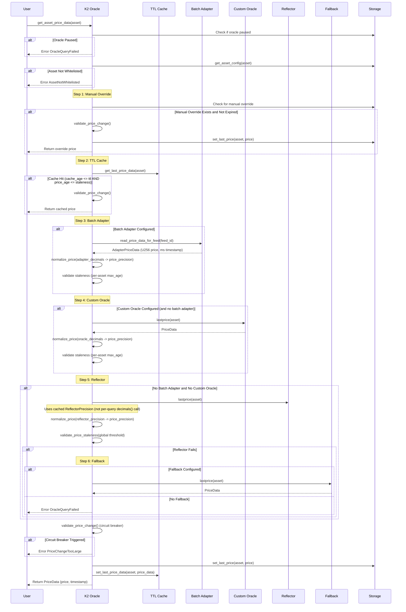
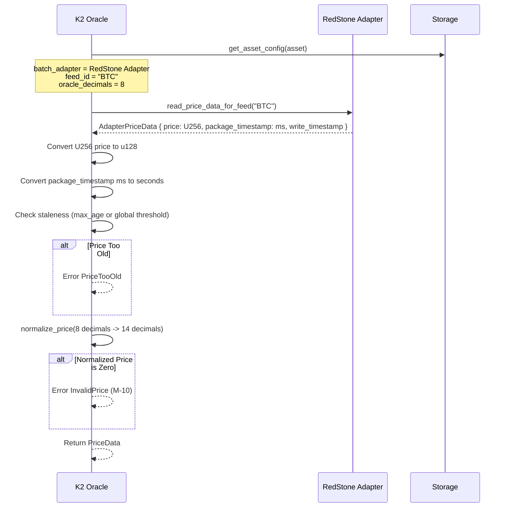
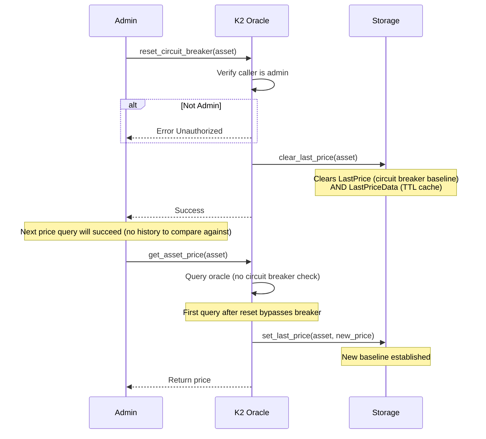

# 8. Oracle Architecture

## Overview

The K2 Oracle is an infrastructure component that provides price feeds for the K2 lending protocol. It supplies price data for collateral and debt valuation, used in liquidation calculations and health factor assessment.

### Role in Protocol

The oracle system is essential for:

1. **Collateral Valuation**: Converting supplied asset amounts to base currency value
2. **Debt Assessment**: Computing loan-to-value (LTV) ratios and health factors
3. **Liquidation Decisions**: Determining when positions become liquidatable
4. **Interest Calculations**: No direct impact, but critical for health assessment
5. **Risk Management**: Protecting against oracle failures, stale prices, and manipulation

### Key Properties

| Property | Value | Notes |
|----------|-------|-------|
| **Price Precision** | 14 decimals | `1e14` per unit (configurable) |
| **Max Staleness** | 3600 seconds | 1 hour default, configurable globally and per-asset |
| **Circuit Breaker** | 2000 bps | 20% max change, configurable |
| **TTL Price Cache** | 0-3600 seconds | 0 = disabled (default), max 1 hour |
| **Max Price History** | Unlimited | Per-asset, cleared on config change |

---

## Price Sources

K2 supports multiple oracle sources for maximum flexibility and redundancy.

### Source Priority

The K2 oracle uses a **six-step cascading priority system** to fetch prices:

```
1. Manual Override (if set and not expired)
        |
        v  (on expiry or not set)
2. TTL Price Cache (if cache hit: cache_age <= ttl AND price_age <= staleness)
        |
        v  (on cache miss or disabled)
3. Batch Adapter (if configured for this asset, e.g. RedStone)
        |
        v  (if not configured — NOTE: failure returns error immediately)
4. Custom Oracle (if configured for this asset)
        |
        v  (if not configured — NOTE: failure returns error immediately)
5. Reflector Oracle (Stellar native)
        |
        v  (on Reflector failure)
6. Fallback Oracle (emergency backup, if configured)
```

**Important behavioral notes:**

- **Batch Adapter and Custom Oracle failures are terminal** — if a batch adapter or custom oracle is configured for an asset and the query fails, the error is returned immediately. The system does **not** fall through to Reflector.
- **Fallback Oracle only applies to Reflector failures** — the fallback is tried only when the Reflector query fails, not for batch adapter or custom oracle failures.
- **TTL Cache is transparent** — a cache hit returns the previously validated price without re-querying external oracles, reducing cross-contract calls.

This ordering ensures:
- **Manual Overrides** take precedence (e.g., during oracle attacks)
- **TTL Cache** reduces redundant cross-contract calls for recently validated prices
- **Batch Adapter** provides direct adapter access (primary path for RedStone assets)
- **Custom Oracle** supports per-asset oracle contracts
- **Reflector** provides Stellar-native asset pricing
- **Fallback** acts as safety net for Reflector failures only

### Reflector Oracle (Stellar)

**Stellar's native price oracle providing on-chain price feeds.**

#### Characteristics
- **Provider**: Stellar Foundation
- **Native**: Built into Stellar ledger
- **Assets**: XLM + whitelisted Stellar-native tokens
- **Precision**: Queried once via `decimals()` and **cached in instance storage** (`ReflectorPrecision`) — not called per-query
- **Availability**: Always available if configured

#### Supported Assets
- Native XLM (symbol "XLM")
- Stellar-issued assets (by contract address or symbol)

#### Query Interface
```rust
// Reflector Oracle contract interface
pub struct Wrapper<'a> {
    env: &'a Env,
    contract_id: Address,
}

impl<'a> Wrapper<'a> {
    pub fn lastprice(&self, asset: &Asset) -> Option<PriceData> {
        // Returns (price, timestamp) or None if not available
    }

    pub fn decimals(&self) -> Option<u32> {
        // Returns oracle precision — called once and cached
    }
}
```

#### Limitations
- Asset must be whitelisted in Reflector
- Limited to Stellar ecosystem

### Batch Oracle Adapter

**Direct adapter integration for external oracle networks (e.g., RedStone).**

The batch adapter is the primary mechanism for integrating external price feeds. Instead of routing through a wrapper contract, the oracle calls the adapter directly using a per-asset `feed_id`.

#### Characteristics
- **Direct Access**: Calls adapter's `read_price_data_for_feed()` / `read_price_data()` directly
- **Feed-Based**: Each asset maps to a specific `feed_id` string (e.g., "BTC", "XLM")
- **Batch Support**: Multiple feeds can be queried in a single cross-contract call
- **Decimals**: Adapter-native (often 8 decimals for RedStone); `normalize_price()` converts to target `price_precision`

### Custom Oracle

**Per-asset oracle contracts implementing a standard interface.**

Any contract implementing the `lastprice()` / `decimals()` interface can be configured as a custom oracle. Custom oracles can return prices in **any decimal precision from 0 to 18** — the `normalize_price()` function handles conversion to the target `price_precision`.

### RedStone Oracle Integration

**External oracle network providing prices for synthetic and cross-chain assets.**

RedStone integration is **deployed and operational** via the batch adapter mechanism. RedStone prices are provided off-chain, submitted to the RedStone adapter contract, and queried by the K2 oracle using `set_batch_oracle` per-asset configuration.

| Field | Description |
|-------|-------------|
| **Feed ID** | Asset identifier (e.g., "BTC", "XLM", "PYUSD") |
| **Raw Price** | Adapter-native decimals (typically 8 for RedStone) |
| **Normalized Price** | Converted to `price_precision` (14 decimals) via `normalize_price()` |
| **Timestamp** | `package_timestamp` in milliseconds, converted to seconds |
| **Verification** | Handled by the adapter contract (signature checks, signer thresholds) |

---

## Price Format

All oracle prices are normalized to the configured **`price_precision`** (default: 14 decimals).

### Precision Model

| Component | Decimals | Example |
|-----------|----------|---------|
| **Oracle Precision** | 14 (default) | 1e14 = 1 unit |
| **WAD (internal)** | 18 | 1e18 = 1 unit |
| **Conversion Factor** | 4 | 10^(18-14) = 10,000 |

### Price Normalization

All oracle sources may return prices in different decimal precisions. The `normalize_price()` function converts any source precision to the target `price_precision`:

```rust
fn normalize_price(
    price: u128,
    source_decimals: u32,   // e.g., 8 for RedStone adapter
    target_decimals: u32,   // e.g., 14 (price_precision)
) -> Result<u128, OracleError> {
    if source_decimals == target_decimals { return Ok(price); }
    if source_decimals > target_decimals {
        // Scale down: divide by 10^(source - target)
        Ok(price / 10u128.pow(source_decimals - target_decimals))
    } else {
        // Scale up: multiply by 10^(target - source)
        price.checked_mul(10u128.pow(target_decimals - source_decimals))
            .ok_or(OracleError::InvalidCalculation)
    }
}
```

**Example**: A RedStone adapter returns BTC at 8 decimals. `normalize_price(6712285000000, 8, 14)` produces `6712285000000000000` (14 decimals).

### Conversion Formula

```
price_wad = price_oracle * (10 ^ (18 - oracle_precision))
          = price_oracle * 10_000  (when oracle_precision = 14)
```

### Price Examples

| Asset | Price (14 decimals) | Interpretation |
|-------|---------------------|-----------------|
| XLM | 250_000_000_000_000 | $0.25 |
| USDC | 1_000_000_000_000_000 | $1.00 |
| BTC | 45_000_000_000_000_000 | $45,000 |
| ETH | 3_000_000_000_000_000 | $3,000 |

### Precision Loss Handling

When converting oracle prices to WAD precision:

```rust
// Incorrect (loses precision)
let price_wad = oracle_price * 10_000;  // May overflow

// Correct (checked arithmetic)
let price_wad = oracle_price
    .checked_mul(10_000)
    .ok_or(OracleError::MathOverflow)?;
```

---

## Reflector Oracle

### Query Process

**Step 1: Asset Mapping (Try-First-Then-Fallback)**

The Reflector query uses a **try-first-then-fallback** pattern for XLM, not a pre-check:

```rust
// First attempt: query as Stellar address
let result = reflector_wrapper.lastprice(&ReflectorAsset::Stellar(addr));

match result {
    Some(data) => Ok(data),
    None => {
        // If this is native XLM, try the symbol-based fallback
        if addr == native_xlm_address {
            reflector_wrapper.lastprice(&ReflectorAsset::Other(Symbol("XLM")))
                .ok_or(OracleError::OracleQueryFailed)
        } else {
            Err(OracleError::OracleQueryFailed)
        }
    }
}
```

This pattern exists because XLM may be registered under different identifiers across networks (address on mainnet, symbol "XLM" on testnet).

**Step 2: Precision Resolution (Cached)**

Reflector precision is **cached in instance storage** as `ReflectorPrecision`, not queried per-call:

```rust
// Precision is read from cache (set during initialization or first query)
let precision = storage::get_reflector_precision(env)
    .unwrap_or_else(|| {
        // Only called once, then cached
        let decimals = reflector_wrapper.decimals().unwrap_or(14);
        storage::set_reflector_precision(env, decimals);
        decimals
    });
```

**Step 3: Price Normalization**
```rust
// Convert from Reflector's native precision to price_precision
let normalized = normalize_price(raw_price, reflector_precision, config.price_precision)?;
```

### Reflector Configuration

Reflector details are stored during initialization:

```rust
pub fn initialize(
    env: Env,
    admin: Address,
    reflector_contract: Address,         // Reflector address
    base_currency_address: Address,      // Base asset (typically USDC)
    native_xlm_address: Address,         // XLM address on this network
) -> Result<(), OracleError>
```

Configuration can be updated by admin:

```rust
pub fn update_reflector_contract(
    env: Env,
    caller: Address,           // Admin only
    new_contract: Address,     // New Reflector contract
) -> Result<(), OracleError>
```

### Reflector Failure Handling

When Reflector query fails, the system attempts the fallback oracle if configured:

```rust
match oracle::get_price_with_protection(env, reflector_addr, asset, config) {
    Ok(data) => data,
    Err(_) => {
        if let Some(fallback_addr) = storage::get_fallback_oracle(env) {
            // Emit event and try fallback
            oracle::get_price_with_protection_fallback(env, fallback_addr, asset, config)?
        } else {
            return oracle::get_price_with_protection(env, reflector_addr, asset, config);
        }
    }
}
```

**Important**: The fallback mechanism applies **only** to the Reflector path. Batch adapter and custom oracle failures return errors immediately.

---

## Batch Oracle Adapter

### Overview

The batch oracle adapter provides direct access to external price feeds (primarily RedStone) without going through a wrapper contract. This reduces footprint overhead and enables batch queries for multiple assets in a single cross-contract call.

### AdapterPriceData

The adapter returns price data in the following format:

```rust
pub struct AdapterPriceData {
    pub price: U256,              // Raw price in adapter-native decimals
    pub package_timestamp: u64,   // Milliseconds (converted to seconds by oracle)
    pub write_timestamp: u64,     // When data was written to adapter
}
```

**Key details:**
- `price` is `U256` (can be large), converted to `u128` after normalization
- `package_timestamp` is in **milliseconds** — the oracle converts to seconds (`/ 1000`)
- Raw decimals are adapter-native (e.g., 8 for RedStone), not 14

### Admin Functions

#### `set_batch_oracle`

Configures a batch adapter for a specific asset:

```rust
pub fn set_batch_oracle(
    env: Env,
    caller: Address,                // Admin only
    asset: Asset,
    adapter: Option<Address>,       // Adapter contract (None to remove)
    feed_id: Option<String>,        // Feed identifier (e.g., "BTC", "XLM")
    decimals: Option<u32>,          // Adapter's decimal precision (0-18, M-05)
    max_age_seconds: Option<u64>,   // Per-asset staleness override
) -> Result<(), OracleError>
```

**Validation**: `decimals` must be 0-18 (M-05 fix).

#### `set_price_cache_ttl`

Configures the global TTL price cache duration:

```rust
pub fn set_price_cache_ttl(
    env: Env,
    caller: Address,    // Admin only
    ttl: u64,           // Seconds (0 = disabled, max 3600)
) -> Result<(), OracleError>
```

**Max TTL**: 3600 seconds (1 hour). Setting to 0 disables the cache entirely.

#### `refresh_prices`

Force-refreshes prices by clearing the TTL cache and re-querying:

```rust
pub fn refresh_prices(
    env: Env,
    assets: Vec<Asset>,
) -> Result<Vec<PriceData>, OracleError>
```

Clears cached entries for the specified assets, then calls `get_asset_prices_vec()` to fetch fresh prices. Useful before budget-sensitive operations (liquidation, swap) to ensure fresh data.

### Single Asset Query

For a single asset with a batch adapter configured:

```rust
fn query_batch_adapter_direct(
    env: &Env,
    adapter_addr: &Address,
    feed_id: &String,
    decimals: u32,
    max_age: Option<u64>,
    price_precision: u32,
    staleness_threshold: u64,
) -> Result<PriceData, OracleError>
```

**Flow:**
1. Call adapter's `read_price_data_for_feed(feed_id)` → `AdapterPriceData`
2. Convert `price` from `U256` to `u128`
3. Convert `package_timestamp` from milliseconds to seconds
4. Check staleness: use per-asset `max_age` if set, else global `staleness_threshold`
5. Normalize price from adapter decimals to `price_precision`
6. Reject zero normalized price (M-10)

### Batch Query

For multiple assets sharing the same adapter:

```rust
fn batch_query_adapter(
    env: &Env,
    adapter_addr: &Address,
    feed_ids: &Vec<String>,
    decimals_list: &Vec<u32>,
    price_precision: u32,
    staleness_threshold: u64,
    max_ages: &Vec<Option<u64>>,
) -> Result<Vec<PriceData>, OracleError>
```

**Flow:**
1. Single cross-contract call: `read_price_data(feed_ids)` → `Vec<AdapterPriceData>`
2. Validate result length matches `feed_ids` length
3. Per-feed: convert timestamp, check staleness (per-asset `max_age`), normalize decimals
4. Return `Vec<PriceData>` in same order as input

The `get_asset_prices_vec()` function automatically groups assets by adapter and uses batch queries where possible.

---

## Custom Oracle

### Interface

Any oracle contract implementing this interface can be used as a custom oracle:

```rust
// Required methods for custom oracle contracts
pub fn decimals(env: Env) -> u32 {
    // Returns source precision — any value from 0 to 18 is valid.
    // normalize_price() handles conversion to price_precision (14).
    8  // Example: 8 decimals
}

pub fn lastprice(env: Env, asset: Asset) -> Option<PriceData> {
    // Return latest price in the oracle's native precision, or None
    Some(PriceData {
        price: price_value,        // In oracle's native decimals
        timestamp: ledger_timestamp,
    })
}
```

**Custom oracles can return any decimal precision from 0 to 18.** The `normalize_price()` function converts from the oracle's native precision to the configured `price_precision` (default: 14). There is no requirement that custom oracles return prices in 14 decimals.

### `set_custom_oracle`

Configures a custom oracle for a specific asset:

```rust
pub fn set_custom_oracle(
    env: Env,
    caller: Address,                // Admin only
    asset: Asset,
    oracle: Option<Address>,        // Custom oracle contract (None to remove)
    max_age_seconds: Option<u64>,   // Per-asset staleness override
    decimals: Option<u32>,          // Cached decimals (0-18), skips decimals() call
) -> Result<(), OracleError>
```

**Parameters:**
- `oracle`: The custom oracle contract address. `None` removes the custom oracle.
- `max_age_seconds`: Per-asset staleness threshold. If `None`, uses global `price_staleness_threshold`.
- `decimals`: Cached decimal precision. If provided, the oracle skips calling `decimals()` on the custom oracle contract, saving a cross-contract call. Validated to be 0-18 (M-05).

### Decimal Handling

When querying a custom oracle:

```rust
// Use cached decimals if available, else call decimals()
let oracle_decimals = cached_decimals.unwrap_or_else(|| {
    custom_oracle_client.decimals()
});

// Validate (M-05)
if oracle_decimals > 18 {
    return Err(OracleError::InvalidConfig);
}

// Normalize to price_precision
let normalized = normalize_price(raw_price, oracle_decimals, price_precision)?;
```

### Failure Behavior

**When a custom oracle query fails, the error is returned immediately.** The system does **not** fall through to Reflector or any other source. This is by design — if an admin has configured a specific oracle for an asset, routing to a different oracle on failure could produce inconsistent pricing.

```rust
// In get_asset_price_data_with_config:
if let Some(custom_oracle) = config.custom_oracle {
    // Query custom oracle — returns Result, not Option
    return query_custom_oracle(env, &custom_oracle, asset, config.max_age, config.oracle_decimals);
    // ^ Returns Ok(price) or Err(error) — no fallthrough
}
```

The same behavior applies to batch adapter failures.

---

## TTL Price Cache

### Overview

The TTL price cache stores recently validated prices to reduce redundant cross-contract oracle calls. It is **separate from** the circuit breaker price cache (`LastPrice`) which only stores the price value for deviation checks.

### CachedPriceData

```rust
pub struct CachedPriceData {
    pub price: u128,       // Validated price (in price_precision decimals)
    pub timestamp: u64,    // Original price observation timestamp
    pub cached_at: u64,    // Ledger timestamp when this entry was cached
}
```

**Key distinction**: `timestamp` is when the price was observed by the oracle source. `cached_at` is when the K2 oracle cached this entry. Both are used for validation.

### Cache Hit Logic

A cache hit requires **both** conditions to be met:

```rust
let current_time = env.ledger().timestamp();
let cache_age = current_time - cached.cached_at;    // How old is the cache entry?
let price_age = current_time - cached.timestamp;     // How old is the underlying price?

if cache_age <= cache_ttl && price_age <= staleness_threshold {
    // Cache hit — return without cross-contract call
    Ok(PriceData { price: cached.price, timestamp: cached.timestamp })
} else {
    // Cache miss — fetch fresh price from oracle source
}
```

This dual check ensures:
1. The cache entry itself is recent enough (`cache_age <= cache_ttl`)
2. The underlying price observation hasn't become stale (`price_age <= staleness_threshold`)

### Configuration

```rust
pub fn set_price_cache_ttl(
    env: Env,
    caller: Address,    // Admin only
    ttl: u64,           // 0 = disabled, max 3600 seconds
) -> Result<(), OracleError>
```

| Setting | Value | Effect |
|---------|-------|--------|
| **Disabled** | `ttl = 0` | Default. Every query hits the oracle source. |
| **Short** | `ttl = 30` | 30-second cache. Good for high-frequency operations. |
| **Maximum** | `ttl = 3600` | 1-hour cache. Matches default staleness threshold. |

### Cache Invalidation

The TTL cache is cleared when:

1. **Manual override set**: `set_manual_override()` calls `clear_last_price_data()` to ensure the override takes effect immediately
2. **Circuit breaker reset**: `reset_circuit_breaker()` clears both `LastPrice` (circuit breaker baseline) and `LastPriceData` (TTL cache)
3. **`refresh_prices()` called**: Explicitly clears cache entries before re-querying

### Storage Keys

| Key | Type | Purpose |
|-----|------|---------|
| `PriceCacheTtl` | Instance `u64` | Global cache TTL setting |
| `LastPriceData(Asset)` | Persistent `CachedPriceData` | Per-asset cached price data |
| `LastPrice(Asset)` | Persistent `u128` | Circuit breaker baseline (separate) |

---

## Timestamp Validation

### Time Sources

Oracle prices include timestamps from different sources:

| Timestamp | Source | Purpose |
|-----------|--------|---------|
| **Price Timestamp** | Oracle source (Reflector, adapter, custom) | When price was observed |
| **Package Timestamp** | Batch adapter (milliseconds, converted to seconds) | When price package was created |
| **Cache Timestamp** | `cached_at` in `CachedPriceData` | When K2 oracle cached the entry |
| **Override Timestamp** | `override_set_timestamp` | When admin set the override (H-01) |

### Validation Rules

```rust
let current_time = env.ledger().timestamp();

// 1. Reject future timestamps (data corruption)
if price_data.timestamp > current_time {
    return Err(OracleError::PriceTooOld);
}

// 2. Reject stale prices (beyond max age)
let age = current_time - price_data.timestamp;
if age > max_age_threshold {
    return Err(OracleError::PriceTooOld);
}
```

### Manual Override Timestamps

**H-01 Fix: Track override timestamp separately:**

```rust
pub struct AssetConfig {
    pub manual_override_price: Option<u128>,
    pub override_expiry_timestamp: Option<u64>,  // When override expires
    pub override_set_timestamp: Option<u64>,     // When override was set (H-01)
}
```

When override is used, return `override_set_timestamp` to enable staleness detection:

```rust
Ok(PriceData {
    price: override_price,
    timestamp: override_set_timestamp,  // Allows staleness check on override
})
```

### Edge Cases

| Scenario | Handling |
|----------|----------|
| **First Price**: No timestamp history yet, always valid (until staleness) |
| **Clock Skew**: Protected by future timestamp check |
| **Ledger Rewind**: Protected by staleness window |
| **Override Expiry**: Detected via expiry timestamp check |

---

## Staleness Checks

### Non-Uniform Staleness

**Staleness is NOT applied uniformly across price sources.** Each source has its own staleness mechanism:

| Source | Staleness Mechanism | Configuration |
|--------|---------------------|---------------|
| **Manual Override** | Uses `override_expiry_timestamp` (absolute expiry, max 7 days). Does not use `validate_price_staleness()`. | Set via `set_manual_override()` |
| **TTL Cache** | Dual check: `cache_age <= cache_ttl` AND `price_age <= staleness_threshold` | `set_price_cache_ttl()` |
| **Batch Adapter** | Per-asset `max_age` from `AssetConfig` if set; else global `price_staleness_threshold` | `set_batch_oracle()` `max_age_seconds` param |
| **Custom Oracle** | Per-asset `max_age` from `AssetConfig` if set; else global `price_staleness_threshold` | `set_custom_oracle()` `max_age_seconds` param |
| **Reflector** | Global `price_staleness_threshold` only. Uses `validate_price_staleness()`. | `set_oracle_config()` |
| **Fallback Oracle** | Global `price_staleness_threshold` only | `set_oracle_config()` |

### `validate_price_staleness()`

This function is called **only for the Reflector path** (and its fallback). Batch adapter and custom oracle paths perform their own inline staleness checks using per-asset `max_age`:

```rust
fn validate_price_staleness(
    price_data: &PriceData,
    oracle_config: &OracleConfig,
) -> Result<(), OracleError> {
    let current_time = env.ledger().timestamp();

    if price_data.timestamp > current_time {
        return Err(OracleError::PriceTooOld);
    }

    let age = current_time - price_data.timestamp;
    if age > oracle_config.price_staleness_threshold {
        return Err(OracleError::PriceTooOld);
    }

    Ok(())
}
```

### Per-Asset Staleness (Batch Adapter / Custom Oracle)

```rust
// In query_batch_adapter_direct / query_custom_oracle:
let effective_max_age = max_age.unwrap_or(staleness_threshold);
let age = current_time - price_timestamp;
if age > effective_max_age {
    return Err(OracleError::PriceTooOld);
}
```

### Zero Staleness Threshold Edge Case

When the global `price_staleness_threshold` is set to 0:

- **Manual overrides**: The `override_set_timestamp` will always appear "too old" (age > 0), causing `PriceSourceNotSet` to be returned. This effectively disables manual overrides.
- **Batch adapter / custom oracle**: If per-asset `max_age` is also not set, the fallback to `staleness_threshold = 0` means any price with `age > 0` is rejected.
- **Reflector**: `validate_price_staleness()` rejects any price where `age > 0`.

**Recommendation**: Always set `price_staleness_threshold` to a positive value (minimum 60 seconds).

### Staleness Threshold Configuration

| Threshold | Network | Use Case |
|-----------|---------|----------|
| 60 seconds | Testnet | Frequent updates |
| 3600 seconds | Mainnet | 1-hour update cycle (default) |
| 86400 seconds | Backup | 24-hour fallback |

### Implications for Liquidations

**Stale prices are rejected to ensure:**

1. Health factor reflects current market conditions
2. Liquidations triggered at appropriate thresholds
3. No liquidations based on outdated price data
4. Circuit breaker has recent baseline for comparison

---

## Router-Side Staleness

### Overview

The router performs its **own** staleness validation after receiving prices from the oracle contract. This is a second layer of defense, separate from the oracle-level staleness checks.

### `validate_price_freshness()`

Located in `kinetic-router/src/price.rs`:

```rust
pub fn validate_price_freshness(
    env: &Env,
    price_timestamp: u64,
    asset: Option<&Address>,    // If provided, checks per-asset threshold
) -> Result<(), KineticRouterError>
```

**Logic:**
1. If `asset` is provided, try `get_asset_staleness_threshold(env, asset)` for a per-asset threshold
2. If no per-asset threshold, fall back to global `get_price_staleness_threshold(env)`
3. Reject future timestamps
4. Reject prices where `age > threshold`

### Router Batch Price Fetching

```rust
pub fn get_prices_for_assets(
    env: &Env,
    assets: &Vec<Address>,
) -> Result<Map<Address, u128>, KineticRouterError>
```

1. Calls oracle's `get_asset_prices_vec()` with all assets in a single batch
2. Validates freshness **per-asset** via `validate_price_freshness()` for each returned price
3. Returns `Map<Address, u128>` (price values only)

### Two-Layer Staleness Model

```
Oracle Level (inside price-oracle contract):
  - Reflector: global staleness_threshold
  - Batch adapter: per-asset max_age or global
  - Custom oracle: per-asset max_age or global

Router Level (inside kinetic-router):
  - Per-asset staleness threshold (if configured)
  - Global price staleness threshold (fallback)
```

This dual-layer approach means the router can enforce **stricter** staleness requirements than the oracle. For example, the oracle might accept a 1-hour-old price, but the router could reject it for a specific asset that requires fresher data.

---

## Circuit Breaker

### Purpose

**Prevents extreme price movements from causing unintended liquidations or breaking calculations.**

Protects against:
- Oracle failures causing price spikes/drops
- Flash crashes triggering incorrect liquidations
- Price manipulation attacks
- Corrupted oracle data

### Threshold Configuration

```rust
pub struct OracleConfig {
    pub max_price_change_bps: u32,  // Basis points (0-10000)
    // Default: 2000 = 20% maximum change
    // 0 = disabled
}
```

### Change Calculation

**Deviation measured as basis points from last known price:**

```rust
fn calculate_price_deviation_bps(
    new_price: u128,
    last_price: u128,
) -> Result<u32, OracleError> {
    if new_price == 0 || last_price == 0 {
        return Err(OracleError::InvalidPrice);
    }

    let diff = new_price.abs_diff(last_price);
    let scaled_diff = diff.checked_mul(10_000)?;
    let deviation = scaled_diff / last_price;  // bps

    u32::try_from(deviation).map_err(|_| OracleError::MathOverflow)
}
```

### Validation Logic

```rust
fn validate_price_change(
    new_price: u128,
    oracle_config: &OracleConfig,
) -> Result<(), OracleError> {
    // Validation disabled (testing, emergency)
    if oracle_config.max_price_change_bps == 0 {
        return Ok(());
    }

    // First query (no history)
    if let Some(last_price) = get_last_price() {
        // Uninitialized (zero price)
        if last_price == 0 {
            return Ok(());
        }

        // Check deviation
        let deviation = calculate_price_deviation_bps(new_price, last_price)?;
        if deviation > oracle_config.max_price_change_bps {
            return Err(OracleError::PriceChangeTooLarge);
        }
    }

    Ok(())
}
```

---

## Circuit Breaker Trigger

### Trigger Condition

**Price change exceeds threshold:**

```
|new_price - last_price| / last_price > max_price_change_bps / 10_000
```

### Example

With default 20% threshold:

| Scenario | Last Price | New Price | Change | Allowed? |
|----------|-----------|-----------|--------|----------|
| **Normal market** | 1.00 | 1.05 | +5% |  Yes |
| **Volatility** | 1.00 | 1.18 | +18% |  Yes |
| **Large move** | 1.00 | 1.21 | +21% |  No |
| **Flash crash** | 1.00 | 0.75 | -25% |  No |
| **Recovery** | 0.75 | 1.00 | +33% |  No |

### Trigger Detection

When triggered, `get_asset_price_data()` returns:
```
Err(OracleError::PriceChangeTooLarge)
```

---

## Circuit Breaker Effects

### Immediate Effects

**When circuit breaker is triggered:**

1. **Price Query Fails**: `get_asset_price_data()` returns error
2. **Liquidations Blocked**: Cannot calculate HF, liquidation calls revert
3. **Supply/Borrow Blocked**: Health factor checks fail
4. **Risk Assessment Frozen**: All operations depending on new price fail

### Ripple Effects

| Operation | Impact |
|-----------|--------|
| **New Supply** |  Fails (HF check required) |
| **New Borrow** |  Fails (HF check required) |
| **Liquidation** |  Fails (price read fails) |
| **Repay/Withdraw** |  Fails if HF check needed |
| **Flash Loan** |  Fails (liquidation callback needs prices) |

### Recovery Path

**Admin resets circuit breaker to allow legitimate large movements:**

```rust
pub fn reset_circuit_breaker(
    env: Env,
    caller: Address,    // Admin only
    asset: Asset,
) -> Result<(), OracleError> {
    storage::clear_last_price(env, asset);  // Clears both LastPrice and LastPriceData
    Ok(())
}

pub fn reset_all_circuit_breakers(
    env: Env,
    caller: Address,    // Admin only
) -> Result<(), OracleError>
```

After reset:
- Last price is cleared (no history)
- TTL cache entry is also cleared
- Next price query succeeds (first query scenario)
- Baseline is reestablished for future comparisons

### Legitimate Use Cases for Reset

- **Major Market Event**: XLM crash or pump
- **Token Upgrade**: Migration to new contract
- **Oracle Migration**: Switching to new price source
- **Data Corruption**: Recovering from bad feed

---

## Manual Overrides

### Purpose

**Emergency price setting by admin for situations where oracle is unavailable or incorrect.**

### Override Configuration

```rust
pub struct AssetConfig {
    pub manual_override_price: Option<u128>,
    pub override_expiry_timestamp: Option<u64>,
    pub override_set_timestamp: Option<u64>,  // H-01 fix
}
```

### Setting an Override

```rust
pub fn set_manual_override(
    env: Env,
    caller: Address,           // Admin only
    asset: Asset,
    price: Option<u128>,       // None to remove
    expiry_timestamp: Option<u64>,  // Required if setting price
) -> Result<(), OracleError>
```

**Validation:**

```
1. Caller is admin
2. Asset is whitelisted
3. Expiry timestamp provided (when setting price)
4. Expiry is in the future
5. Expiry - now <= 7 days (L-04 fix)
6. New price passes circuit breaker check
7. TTL cache cleared for this asset (ensures override takes effect)
```

### Override Behavior

**When override exists and is valid:**

1. Override price is used instead of oracle price
2. Override timestamp is returned (for staleness checks)
3. Circuit breaker is applied to override too
4. Events emitted if expiry is near (within 1 hour)

```rust
let price_data = if let Some(override_price) = config.manual_override_price {
    if current_time < override_expiry {
        // Apply circuit breaker to override
        validate_price_change(override_price, oracle_config)?;

        PriceData {
            price: override_price,
            timestamp: override_set_timestamp,  // H-01
        }
    } else {
        // Override expired, fall through to normal oracle
        // ...
    }
};
```

### Override Expiration

**Automatic removal after expiry:**

```rust
if current_time >= expiry_timestamp {
    // Override expired
    config.manual_override_price = None;
    config.override_expiry_timestamp = None;
    config.override_set_timestamp = None;

    // Preserve override price as circuit breaker baseline
    storage::set_last_price(env, &asset, override_price);

    // Fall through to normal oracle query
}
```

### Removal

**Admin can remove override anytime:**

```rust
set_manual_override(env, caller, asset, None, None)?;
```

### Constraints

| Constraint | Reason |
|-----------|--------|
| **Must have expiry** | Prevents permanent mispricing |
| **Max 7 days** | Forces regular admin review |
| **Circuit breaker applies** | Prevents extreme admin errors |
| **Timestamp recorded** | Enables staleness detection |
| **Cache cleared on set** | Ensures override takes effect immediately |

---

## Oracle Accuracy

### Precision Loss

**Price conversions can cause rounding and precision loss.**

### Sources of Loss

1. **Oracle Precision**: Native 14 decimals can't represent all values
2. **Conversion to WAD**: Multiplication by 10_000
3. **Division Operations**: Health factor calculation (collateral x price / debt)
4. **Integer Truncation**: Rust u128 division rounds down

### Mitigation Strategies

| Scenario | Strategy |
|----------|----------|
| **Consecutive multiplications** | Use U256 for intermediate values |
| **Division loss** | Use `ray_div_down`/`ray_div_up` for directionality |
| **Liquidation rounding** | M-14: Directional rounding prevents unfair liquidations |

### Precision Example

```rust
// Converting oracle price to WAD
let oracle_price = 1_500_000_000_000_000_u128;  // 14 decimals
let price_wad = oracle_price
    .checked_mul(10_000)
    .ok_or(OracleError::MathOverflow)?;
// = 15_000_000_000_000_000_000 (18 decimals)

// Health factor calculation (avoid overflow)
let hf = collateral_value_wad
    .checked_mul(ltv_threshold)
    .checked_mul(WAD)
    .checked_div(10_000)
    .checked_div(debt_value_wad)
    .ok_or(OracleError::MathOverflow)?;
```

### Rounding Direction

**M-14 Fix: Consistent directional rounding for fairness:**

- **Liquidations**: Use `ray_div_down` (rounds in favor of liquidator slightly, but prevents false liquidations)
- **Health Factor**: Use `ray_div_down` (conservative, errs on safer side)
- **Interest Accrual**: Use `ray_mul_up` for suppliers, `ray_mul_down` for borrowers (fair to both)

---

## Circuit Breaker Price Cache

### Purpose

**Stores the last validated price value for circuit breaker deviation checks.** This is separate from the TTL price cache.

| Cache | Storage Key | Stores | Purpose |
|-------|-------------|--------|---------|
| **Circuit Breaker** | `LastPrice(Asset)` | `u128` price value | Baseline for deviation check |
| **TTL Cache** | `LastPriceData(Asset)` | `CachedPriceData` (price + timestamps) | Avoid redundant oracle calls |

### Storage

```rust
pub enum PersistentKey {
    LastPrice(Asset),      // Circuit breaker baseline (u128)
    LastPriceData(Asset),  // TTL cache (CachedPriceData)
}

// Access functions
pub fn get_last_price(env: &Env, asset: &Asset) -> Option<u128>
pub fn set_last_price(env: &Env, asset: &Asset, price: u128)
pub fn clear_last_price(env: &Env, asset: &Asset)  // Clears BOTH LastPrice and LastPriceData
```

### Update Timing

**Both caches are updated after validation passes:**

```rust
// 1. Query price from oracle source
let price_data = query_oracle()?;

// 2. Source-specific staleness check (varies by source)
// ... (see Staleness Checks section)

// 3. Validate circuit breaker
validate_price_change(&price_data.price, config)?;

// 4. Update circuit breaker baseline
storage::set_last_price(env, &asset, price_data.price);

// 5. Update TTL cache
storage::set_last_price_data(env, &asset, &price_data);

// 6. Return to caller
Ok(price_data)
```

### Clearing Cache

**Caches are cleared when:**

```rust
// 1. Admin resets circuit breaker (clears both)
reset_circuit_breaker(env, asset)?;

// 2. Oracle config changes (clears all circuit breaker baselines)
set_oracle_config(env, config)?;

// 3. Manual override set (clears TTL cache only)
set_manual_override(env, asset, price, expiry)?;

// 4. Asset removed from whitelist
remove_asset(env, asset)?;

// 5. refresh_prices() called (clears TTL cache, then re-fetches)
refresh_prices(env, assets)?;
```

### Implications

- First price query after cache clear bypasses circuit breaker (initialization)
- Circuit breaker protection is quickly reestablished after config change
- Prevents stale baselines from persisting after major updates

---

## Fallback Mechanism

### Purpose

**Provides backup oracle when the Reflector oracle fails.**

### Configuration

```rust
// Set fallback oracle (optional)
pub fn set_fallback_oracle(
    env: Env,
    caller: Address,           // Admin only
    fallback_contract: Option<Address>,  // None to remove
) -> Result<(), OracleError>

// Query fallback oracle
pub fn get_fallback_oracle(env: Env) -> Option<Address>
```

### Activation Scope

**The fallback oracle is tried ONLY when the Reflector query fails:**

```
Batch Adapter configured?
    | Yes: Query batch adapter
    |   | Succeeds: Return price
    |   | Fails: Return error (NO fallback)
    |
Custom Oracle configured?
    | Yes: Query custom oracle
    |   | Succeeds: Return price
    |   | Fails: Return error (NO fallback)
    |
Try Reflector Oracle
    | Succeeds: Return price
    | Fails:
        Check if fallback configured?
            | Yes: Try Fallback Oracle
            |   | Succeeds: Return price (emit "fallback_used" event)
            |   | Fails: Return fallback error
            | No: Return Reflector error
```

**This is important**: If a batch adapter or custom oracle is configured for an asset and fails, the system does **not** try Reflector or the fallback. The error is returned immediately. The fallback mechanism only provides redundancy for the Reflector path.

### Interface Requirements

Fallback oracle must implement the same interface as custom oracle:

```rust
pub fn decimals(env: Env) -> u32
pub fn lastprice(env: Env, asset: Asset) -> Option<PriceData>
```

**Note**: Unlike Reflector, the fallback oracle's `decimals()` is always called per-query (not cached).

---

## Asset Mapping

### Asset Representation

**Two types of assets supported:**

```rust
pub enum Asset {
    Stellar(Address),   // Stellar-native token by contract
    Other(Symbol),      // External asset by symbol (BTC, ETH, etc.)
}
```

### Whitelisting

**Assets must be added before prices can be queried:**

```rust
pub fn add_asset(
    env: Env,
    caller: Address,    // Admin only
    asset: Asset,
) -> Result<(), OracleError>

pub fn add_asset_by_address(
    env: Env,
    caller: Address,
    asset_address: Address,  // Convenience for Stellar assets
) -> Result<(), OracleError>
```

### Asset Configuration

**Each asset has associated configuration:**

```rust
pub struct AssetConfig {
    pub asset: Asset,
    pub enabled: bool,                          // Enable/disable price queries
    pub manual_override_price: Option<u128>,
    pub override_expiry_timestamp: Option<u64>,
    pub override_set_timestamp: Option<u64>,    // H-01 fix
    pub custom_oracle: Option<Address>,         // Custom oracle address
    pub max_age: Option<u64>,                   // Per-asset staleness (shared by custom oracle & batch adapter)
    pub oracle_decimals: Option<u32>,           // Cached decimals (skips cross-contract call)
    pub batch_adapter: Option<Address>,         // Batch adapter contract address
    pub feed_id: Option<String>,               // Feed identifier for batch adapter (e.g., "BTC")
}
```

### Asset Lifecycle

1. **Add**: Admin calls `add_asset()`, stored in persistent storage
2. **Enable/Disable**: Admin can toggle `enabled` flag
3. **Configure**: Admin sets custom oracle, batch adapter, or manual override
4. **Remove**: Admin calls `remove_asset()`, completely deleted

```rust
pub fn set_asset_enabled(
    env: Env,
    caller: Address,
    asset: Asset,
    enabled: bool,
) -> Result<(), OracleError>

pub fn remove_asset(
    env: Env,
    asset: Asset,
) -> Result<(), OracleError>  // Clears all config + last price
```

### Querying Configuration

```rust
pub fn get_asset_config(
    env: Env,
    asset: Asset,
) -> Option<AssetConfig>

pub fn get_whitelisted_assets(
    env: Env,
) -> Vec<Asset>
```

---

## Configuration

### Oracle Configuration Structure

```rust
pub struct OracleConfig {
    pub price_staleness_threshold: u64,    // Max age in seconds (default: 3600)
    pub price_precision: u32,              // Oracle decimals (default: 14)
    pub wad_precision: u32,                // Protocol decimals (default: 18)
    pub conversion_factor: u128,           // oracle_to_wad factor (default: 10_000)
    pub ltv_precision: u128,               // LTV math precision (default: 1e18)
    pub basis_points: u128,                // Basis points (default: 10_000)
    pub max_price_change_bps: u32,         // Circuit breaker (default: 2000)
}
```

### Default Configuration

```rust
pub const DEFAULT_ORACLE_CONFIG: OracleConfig = OracleConfig {
    price_staleness_threshold: 3600,           // 1 hour
    price_precision: 14,
    wad_precision: 18,
    conversion_factor: 10_000,                 // 10^(18-14)
    ltv_precision: 1_000_000_000_000_000_000, // 1e18
    basis_points: 10_000,
    max_price_change_bps: 2000,                // 20%
};
```

### Configuration Updates

**Admin can update configuration (triggers cache clear):**

```rust
pub fn set_oracle_config(
    env: Env,
    caller: Address,    // Admin only
    config: OracleConfig,
) -> Result<(), OracleError> {
    // Validate price_precision (M-05 fix)
    if config.price_precision > 18 {
        return Err(OracleError::InvalidConfig);
    }

    // Store config
    storage::set_oracle_config(env, config);

    // Clear price cache (L-05 fix)
    // All last prices cleared to prevent stale baselines
    clear_all_price_caches();

    Ok(())
}
```

### Configuration Retrieval

```rust
pub fn get_oracle_config(env: Env) -> Result<OracleConfig, OracleError>
```

**Note**: `price_precision` in the returned config reflects the cached Reflector precision (`ReflectorPrecision` in instance storage), merged at read time.

---

## Failures and Errors

### Error Types

| Error | Code | Cause | Recovery |
|-------|------|-------|----------|
| **AssetNotWhitelisted** | 7 | Asset not added | Admin adds asset |
| **AssetDisabled** | 8 | Asset disabled | Admin enables asset |
| **PriceTooOld** | 4 | Stale price | Wait for update |
| **OracleQueryFailed** | 9 | Oracle unreachable | Try fallback, retry |
| **PriceChangeTooLarge** | 16 | Circuit breaker triggered | Admin resets, wait |
| **InvalidPrice** | (OracleError) | Zero price from oracle | Oracle malfunction |
| **NotInitialized** | 6 | Oracle not initialized | Admin initializes |
| **PriceSourceNotSet** | - | No valid source (e.g., zero staleness + manual override) | Configure valid source |

### Handling Stale Prices

**When price is too old:**

```
1. Operation blocked until fresh price available
2. If Reflector update delayed, activate fallback oracle
3. Admin can set manual override as temporary measure
4. Or reset circuit breaker if that's the blocker
```

### Handling Missing Prices

**When asset has no price history:**

```
1. Query oracle source (batch adapter, custom oracle, or Reflector)
2. If oracle fails:
   - Batch adapter / custom oracle: error returned immediately
   - Reflector: try fallback (if configured)
   - If fallback fails, return error
3. If oracle succeeds but price is zero:
   - Return InvalidPrice error (M-10 fix)
   - Asset needs configuration review
```

### Cascading Failures

**Price failure impacts:**

```
get_asset_price() fails
    [DOWN]
All health factor checks fail
    [DOWN]
Liquidations blocked
    [DOWN]
Potentially undercollateralized positions cannot be closed
```

### Mitigation Strategies

| Scenario | Mitigation |
|----------|-----------|
| **Single oracle down** | Fallback oracle provides continuity (Reflector only) |
| **All oracles down** | Manual override by admin (temporary) |
| **Price corruption** | Circuit breaker limits damage |
| **Stale prices** | Per-asset max_age + router-side freshness check |

---

## Examples

### Query Reflector Price

```rust
// 1. Initialize oracle with Reflector
let reflector_addr = Address::from_string("CAZ..."); // Stellar Reflector
PriceOracleContract::initialize(
    env,
    admin,
    reflector_addr,
    usdc_asset,
    xlm_asset,
)?;

// 2. Add asset to whitelist
PriceOracleContract::add_asset(env, admin, Asset::Other(Symbol("BTC")))?;

// 3. Query price
let price_data = PriceOracleContract::get_asset_price_data(
    env,
    Asset::Other(Symbol("BTC")),
)?;

println!("BTC price: {} (14 decimals)", price_data.price);
println!("Timestamp: {} (unix seconds)", price_data.timestamp);
```

### Configure Batch Adapter (RedStone)

```rust
// 1. Set batch adapter for BTC
PriceOracleContract::set_batch_oracle(
    env,
    admin,
    Asset::Other(Symbol("BTC")),
    Some(redstone_adapter_address),   // Adapter contract
    Some(String::from("BTC")),        // Feed ID
    Some(8),                          // RedStone returns 8 decimals
    Some(300),                        // Per-asset max age: 5 minutes
)?;

// 2. Enable TTL cache (optional, reduces cross-contract calls)
PriceOracleContract::set_price_cache_ttl(env, admin, 30)?;  // 30-second cache

// 3. Query price — will use batch adapter path
let price_data = PriceOracleContract::get_asset_price_data(
    env,
    Asset::Other(Symbol("BTC")),
)?;
// Price normalized from 8 decimals to 14 decimals

// 4. Force refresh before liquidation
let fresh_prices = PriceOracleContract::refresh_prices(
    env,
    vec![Asset::Other(Symbol("BTC")), Asset::Stellar(xlm_addr)],
)?;
```

### Custom Oracle Price

```rust
// 1. Set custom oracle for specific asset (6 parameters)
PriceOracleContract::set_custom_oracle(
    env,
    admin,
    Asset::Other(Symbol("ETH")),
    Some(custom_oracle_address),  // Oracle contract
    Some(3600),                   // Per-asset max age: 1 hour
    Some(8),                      // Oracle returns 8 decimals (cached, skips decimals() call)
)?;

// 2. Query custom oracle
let price_data = PriceOracleContract::get_asset_price_data(
    env,
    Asset::Other(Symbol("ETH")),
)?;
// Price normalized from 8 decimals to 14 decimals

// 3. Remove custom oracle (reverts to Reflector path)
PriceOracleContract::set_custom_oracle(
    env,
    admin,
    Asset::Other(Symbol("ETH")),
    None,   // Remove oracle
    None,   // Remove max_age
    None,   // Remove cached decimals
)?;
```

### Manual Override

```rust
// 1. Oracle fails, set temporary override
let expiry = env.ledger().timestamp() + 3600;  // 1 hour
PriceOracleContract::set_manual_override(
    env,
    admin,
    Asset::Other(Symbol("BTC")),
    Some(50_000_000_000_000_000),  // $50k in 14 decimals
    Some(expiry),
)?;

// 2. Price queries use override
let price_data = PriceOracleContract::get_asset_price_data(
    env,
    Asset::Other(Symbol("BTC")),
)?;
assert_eq!(price_data.price, 50_000_000_000_000_000);

// 3. Override expires automatically
// After expiry time, falls back to oracle query

// 4. Admin removes override early if needed
PriceOracleContract::set_manual_override(
    env,
    admin,
    Asset::Other(Symbol("BTC")),
    None,
    None,
)?;
```

### Handling Circuit Breaker

```rust
// 1. Query succeeds, price stored
let price1 = PriceOracleContract::get_asset_price(
    env,
    Asset::Other(Symbol("XLM")),
)?;  // e.g., 1_000_000_000_000_000 ($0.10)

// 2. Extreme price movement triggers circuit breaker
// Attempt to query new price: 2_500_000_000_000_000 (+150%)
// validate_price_change() fails
let price2_result = PriceOracleContract::get_asset_price(
    env,
    Asset::Other(Symbol("XLM")),
);
assert!(price2_result.is_err());
// Returns Err(OracleError::PriceChangeTooLarge)

// 3. Admin resets circuit breaker
PriceOracleContract::reset_circuit_breaker(
    env,
    admin,
    Asset::Other(Symbol("XLM")),
)?;

// 4. Price query succeeds (no last price history)
let price3 = PriceOracleContract::get_asset_price(
    env,
    Asset::Other(Symbol("XLM")),
)?;  // e.g., 2_500_000_000_000_000 ($0.25)
// Circuit breaker reestablished with new baseline
```

### Health Factor Calculation

```rust
// Oracle provides prices
let xlm_price = oracle.get_asset_price(env, xlm)?;      // 500_000_000_000_000 ($0.50)
let usdc_price = oracle.get_asset_price(env, usdc)?;    // 1_000_000_000_000_000 ($1.00)

// User has 1000 XLM collateral, 300 USDC debt
let collateral_value = 1000 * xlm_price / 10_000;  // Divide by conversion factor
let debt_value = 300 * usdc_price / 10_000;

// Health factor calculation (LTV = 80%, threshold = 85%)
let hf = collateral_value * 8500 / debt_value;  // 8500 bps = 85%
// hf = 500 * 8500 / 300 = 14.16 (healthy, > 1.0)
```

---

## Sequence Diagrams

### Full Price Resolution



### Batch Adapter Query



### Circuit Breaker Reset



---

## Cross-References

### Related Documents
- [Core Concepts - Health Factor](03-CORE-CONCEPTS.md#health-factor): Uses oracle prices for calculation
- [Liquidation System](06-LIQUIDATION.md): Oracle prices determine liquidation eligibility
- [Admin & Governance - Oracle Management](11-ADMIN.md#oracle-management): Configuration and emergency controls
- [Security Model](09-SECURITY.md): Authorization and invariants for oracle operations
- [Glossary - Precision Values](15-GLOSSARY.md#precision-values): Decimal precision reference

### Security Audit References
- **H-01**: Manual override timestamp tracking (override_set_timestamp)
- **M-05**: Oracle precision validation (max 18 decimals)
- **M-07**: Per-asset staleness thresholds
- **M-10**: Zero price rejection (invalid oracle data)
- **M-14**: Directional rounding for liquidation fairness
- **L-04**: Manual override max duration (7 days)
- **L-05**: Cache invalidation on config change
- **L-06**: Override preservation as circuit breaker baseline
- **WP-H7**: TTL cache cleared when manual override set

---

**Last Updated**: March 2026
**Version**: 2.0
